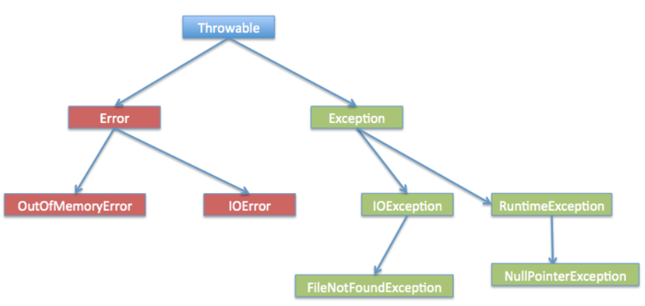
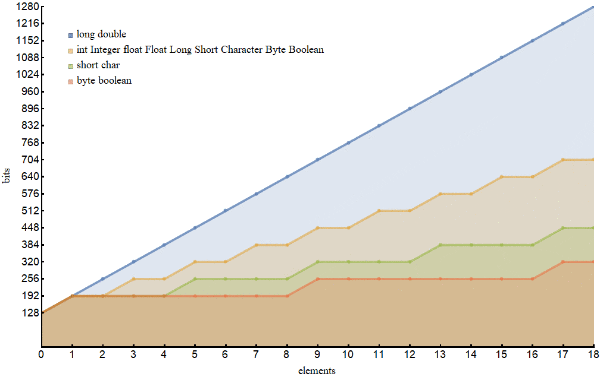
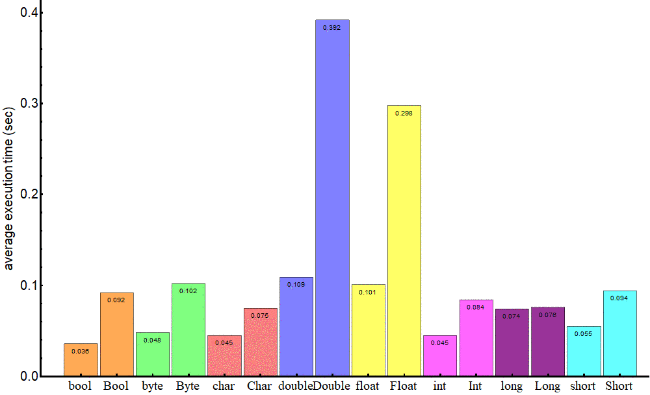

# 1. Java core

- I part
    - Exceptions
    - Enum
    - Strings
    - Object initialization. The order of initialization.
    - Static
    - Keywords, access modifiers
    - Interfaces vs abstract classes, similarities/differences
    - Primitives and wrappers (Why wrappers are needed)
    - Object, its methods
- II part
    - Annotations
    - Reflection
    - Generics
- III part
    - Wildcard, invariance and covariance, super и extends

## Part I

### Исключения

Ссылка: https://www.tutorialspoint.com/java/java_exceptions.htm

**Что такое ошибка?**

Exception - это событие об ошибке, которое может произойти во время исполнения программы и прервать ее обычный flow. Исключения могут появиться из разных ситуаций. Как только происходит ошибка во время выполнения программы, создается excpetion объект и потом JRE пытается найти handler для этой ошибки. Если она его находит, то мы попадаем в этот хэндер и обрабатываемся им, этот процесс называется exception catching. Если никакого хэндлера не было найдено, то приложение выкидывает ошибку в runtime и JRE останавливает программу.
Java Exception handling - это фреймворк, который хэндлит только ошибки runtime. Ошибки компиляции не хэндлятся этим фреймфорком.

**Ключевые слова в java exception handling?**

Есть 4 ключевых слова, которые используются для exception handling в java

1. `throw` используется для того, чтобы выкидывать ошибки
2. `throws` используется для того, чтобы отметить метод, какие checked exceptions он выкидывает
3. `try-catch` используется для error catching-а
4. `finally` опциональный блок и может быть использован только с try catch

**Иерархия ошибок в java**

Исключения в java имеют свою иерархию и наследование используется для категоризации разных типов ошибок. `Throwable` родительский класс иерархии в java exceptions и у него есть два ребенка `Error` и `Exception`. Exceptions далее разбиваются на checked exception и runtime exception.

- `Errors` - исключительные сценарии, которые outof scope of application и их невозможно предвидеть и recover из них. Например, hrware failure, JVM crash или OOM.
- `Checked Exceptions` это ошибки, которые мы можем предусмотреть и обработать. Например, FileNotFoundException. `Exception` - родитель для всех checked exceptions
- `Runtime Exceptions` это ошибки, которые вызваны bad programming, например, попытки обратиться к массиву по несуществующему индексу. ArrayIndexOutOfBoundException. `RuntimeException` - родитель для всех runtime exception



**Какие важные методы есть у Java Exception?**

Обычно ошибки не провайдят никаких специальных методов и все основные методы написаны в базовом классе Throwable

1. String getMessage() - возвращает строку Throwable и сообщение может быть явно указано в конструкторе
2. String getLocalizedMessage()
3. synchronized Throwable getCause()
4. toString() - возвращает информацию о Throwable
5. void printStackTrace()

**Какая разница между checked и unchecked ошибками в Java?**

1. Checked exceptions должны хэндлиться в коде используя try catch блок. Unchecked exceptions не требуется чтобы были схэндены программой и их не надо указывать их в throws clause.
2. `Exception` супер класс для всех checked exceptions, в то время как RuntimeException - super class для всех unchecked exceptions. RuntimeException это ребенок Exception.

### Enum

Ссылка: https://metanit.com/java/tutorial/3.8.php

Кроме отдельных примитивных типов данных и классов в Java есть такой тип как enum или перечисление. Перечисления представляют набор логически связанных констант. Объявление перечисления происходит с помощью оператора enum, после которого идет название перечисления. Затем идет список элементов перечисления через запятую:

```java
enum Day{
    MONDAY,
    TUESDAY,
    WEDNESDAY,
    THURSDAY,
    FRIDAY,
    SATURDAY,
    SUNDAY
}
```

Перечисление фактически представляет новый тип, поэтому мы можем определить переменную данного типа и использовать ее:

**Методы перечислений**

Каждое перечисление имеет статический метод `values()`, он возвращает массив всех констант перечисления.
Метод `ordinal()` возвращает порядковый номер определенной константы (нумерация начинается с 0):

**Конструкторы, поля и методы перечисления**

```java

public class Program {
    public static void main(String[] args) {
        System.out.println(Color.RED.getCode()); // #FF0000
        System.out.println(Color.GREEN.getCode()); // #00FF00
    }
}
enum Color {
    RED("#FF0000"), BLUE("#0000FF"), GREEN("#00FF00");
    private String code;
    Color(String code){
        this.code = code;
    }
    public String getCode(){ return code;}
    
}
```

### Строки

Ссылка: https://www.journaldev.com/1321/java-string-interview-questions-and-answers

**Что такое String?**

String - класс в java.lang package. Это не примитивный тип данных, как long, int. Строка - immutable и final в java и JVM использует String Pool (отдельное место в java heap), чтобы хранить все объекты строк. Инициализировать строку можно через двойные кавычки или через перегрузку в виде знака "+" для конкатенации строк.

**Как создать строку?**

Можно создать объект строки через "new" оператор, как и любой другой класс в java, можно использовать двойные кавычки. Есть несколько конструкторов в классе String, чтобы получить String из char array, byte array, StringBuffer or StringBuilder.
```java
public class Program {
    String str = new String("abc");
    String str1 = "abc";
}
```

Когда мы создаем строку через двойные кавычки, то JVM ищет в String pool объект с таким же значением. Если находит, то просто ссылается на уже существующий объект, если нет, то создает новый экземпляр класса String с текущим значением и хранит его в String pool. Когда мы используем ключевое слово new, jvm создает объект String, но не сохраняет его в String pool. Мы можем использовать intern() метод для хранения объектов строк в String pool или возвращать ссылку, если тут уже есть строка с таким же значением, содержащимся где-то в pool.

**Как мы можем сделать строку upperCase, lowerCase?**

Можно использовать toUpperCase(), toLowerCase() методы для перевода строки в соответствующий регистр. Эти методы могут принимать locale argument и использовать правила конкретной locale для превращения строки в upper или lower case.

**Что такое subSequence метод для строк?**

В java 1.4 был представлен CharSequence интерфейс и String реализует этот интерфейс, это единственная причина для реализации subSequence метода в строке. Внутренне, он вызывает String substring метод.

**Как сравнить две строки в Java?**

Java String реализует интерфейс Comparable и у него есть два варианта compareTo() метода. `compareTo(String anotherString)` метод сравнивает объект строки с параметром строки, который был передан лексикографически. Если объект строки предшествует переданному аргументу, он возвращает отрицательное int, если объект строки следует аргументу, который был передан, он возвращает положительный int. Возвращает 0, если обе строки имеют одинаковое значение. В этом случае equals(String str) метод тоже вернет true.
`compareToIgnoreCase(String str)` - этот метод такой же, как первый, только он игнорирует кейс. Он использует String CASE_INSENSITIVE_ORDER Comparator для безразличия к кейсу. Если значение 0, то equalsIgnoreCase(String str) тоже вернет true.

**Как можно разделить строку в Java?**

Можно использовать `split(String regex)` для того, чтобы разделить строку на массив строк, основываясь на регулярке.

**Как проверить, равны ли строки в Java?**

Есть два способа это сделать

- используя `==` - проверяет значение строки и ее ссылку
- `equals` - эта штука сравнивает каждый символ строки по очереди, вместо ссылки на строку
- `equalsIgnoreCase`

**Почему строка immutable и final**

Есть несколько обоснований, почему строка immutable и final.

`final` - ключевое слово, которое может быть использовано для классов, методов, переменных. Если переменная обозначена как final, то ее значение не может быть изменено, по сути это константа
`immutablity` - означает, что не может быть изменено, мы не можем изменить состояние этого объекта
`final` - мы не можем поменять ссылку на объект, но можем менять его состояние, например, используя getter-ы и setter-ы. можно использовать как для объектов, так и для свойств класса
`immutable` - означает, что мы не можем менять state объекта, но мы можем поменять ссылку на другой объект. может быть только у объектов, но не у переменных

Делая переменную final мы не делаем ее неизменяемой, мы можем проводить любые операции с ней, но не можем заново проинициализировать. Final говорит, что ссылка на объект останется такой же, в то время как неизменяемость говорит, что мы не можем менять состояние объекта, как после его создания. 

Итак, почему строка immutable и final:

- **string pool** стал возможен, потому что string is immutable
- **security** строки используются для хранения информации, которая не желательна к изменению, например, пароли, урлы к базе, если бы строка была изменяемой, то эти параметры можно было бы менять
- **synchronization and concurrency** создание строки неизменяемой автоматически делает ее thread safe, решая проблемы синхронизации
- **caching** оптимизация компилятора
- **class loading** строки используются как аргументы для class loading-а. Если бы они были изменяемыми, то возможно было бы загрузка не тех классов

**StringBuffer и StringBuilder**

Поскольку строка неизменяемый тип данных, то всегда, когда мы производим манипуляции со строками, мы создаем новую строку. Это ресурсо затратно, Java предоставляет нам два класса StringBuilder и StringBuffer для того, чтобы изменять строки. StringBuffer и StringBuilder изменяемые классы. Операции со StringBuffer thread safe и synchronized, а со StringBuilder-ом все операции не thread safe. Так что в multi threaded env нужно использовать StringBuffer, а в single threaded env нужно использовать StringBuilder. StringBuilder быстрее из-за отсутствия overhead с синхронизацией.

**Как работает StringBuilder?**

Основные методы сосредоточены в `AbstractStringBuilder`.

Там char[] уже не private final, а просто char[].
Метод `append` вызывает метод System.arrayCopy() от текущего значения и добавляет один массив char к другому массиву char-ов.

**Почему пароли лучше хранить в char[], а не в строках?**

Строка хранится в string pool, так что когда мы уже не используем строку, она хранится там еще какое-то время, пока до нее не доберется garbage collector. В то время как char[] можно самостоятельно выставить в пустой список, не дожидаясь GC.

**Что делает метод intern()?**

Когда вызывается метод intern, если в pool уже есть строка, которая вернет equals() true. Тогда строка из pool будет возвращена. В противном случае intern добавит в pool эту строку и вернет на нее ссылку. Этот метод всегда возвращает строку с таким же value, но гарантирует, что она будет возвращена из string pool

**Почему string популярный ключ в hash map?**

Поскольку строка неизменяемая, то ее hashcode сохраняется сразу, как только создается объект и ему не надо высчитываться снова, что делает его прекрасным ключем в hash map и его обработка быстрее, чем другие ключи в hash map.

### Создание объекта (тут про порядок инициализации)

Ссылка: https://javarush.ru/groups/posts/2137-porjadok-deystviy-pri-sozdanii-obhhekta

`Cat cat = new Cat();`

1. Сначала для хранения объекта выделяется память.
2. Далее Java-машина создает ссылку на этот объект (в нашем случае ссылка — это Cat cat).
3. В завершение происходит инициализация переменных и вызов конструктора (этот процесс мы рассмотрим подробнее).

Кроме того, жизненный цикл объекта длится до тех пор, пока на него существует хоть одна ссылка. Если же их не осталось, объект станет добычей для сборщика мусора.

Разберем порядок инициализации в объекте. Класс Truck представляет собой реализацию грузовика: с полями, отражающими его год выпуска, модель и максимальную скорость.

```java
public class Car {
   public static int carCounter = 0;
   private String description = "Абстрактная машина";

   public Car() {
   }

   public String getDescription() {
       return description;
   }
}

public class Truck extends Car {
   private static int truckCounter = 0;
   private int yearOfManufacture;
   private String model;
   private int maxSpeed;

   public Truck(int yearOfManufacture, String model, int maxSpeed) {
       this.yearOfManufacture = yearOfManufacture;
       this.model = model;
       this.maxSpeed = maxSpeed;

       Car.carCounter++;
       truckCounter++;
   }
}
```

Итак, мы хотим создать один такой объект:

```java
public class Main {
   public static void main(String[] args) throws IOException {
       Truck truck = new Truck(2017, "Scania S 500 4x2", 220);
   }
}
```

Вот как будет выглядеть этот процесс с точки зрения Java-машины:

1. Первое что произойдет — проинициализируются статические переменные класса `Car`. Да-да, именно класса `Car`, а не `Truck`. Статические переменные инициализируются еще до вызова конструкторов, и начинается это в классе-родителе. Давай попробуем проверить. Выставим счетчик `carCounter` в классе `Car` на 10 и попробуем вывести его в консоль в обоих конструкторах — `Car` и `Truck`.
2. После инициализации статических переменных класса-предка инициализируются статические переменные класса-потомка. То есть в нашем случае — поле `truckCounter` класса `Truck`.
3. Время конструкторов все еще не пришло! Инициализация переменных продолжается. Третьими по счету будут инициализированы нестатические переменные класса-предка.
4. Наконец, дело дошло до конструкторов! Точнее, до конструктора базового класса. Начало его работы — четвертый пункт в процессе создания объекта.
5. Теперь пришла очередь инициализации нестатических полей класса-потомка, то есть нашего класса Truck. Поля класса, объект которого мы создаем, инициализируются только в пятую очередь!
6. Вызывается конструктор дочернего класса `Truck`. И только сейчас, в последнюю очередь, будет вызван конструктор того класса, объект которого мы создаем!

### Static

Ссылка: https://metanit.com/java/tutorial/3.4.php

Кроме обычных методов и полей класс может иметь статические поля, методы, константы и инициализаторы. Например, главный класс программы имеет метод main, который является статическим:
Для объявления статических переменных, констант, методов и инициализаторов перед их объявлением указывается ключевое слово static.

**Статические поля**

При создании объектов класса для каждого объекта создается своя копия нестатических обычных полей. А статические поля являются общими для всего класса. Поэтому они могут использоваться без создания объектов класса.

Например, создадим статическую переменную:

```java
public class Program {
      
    public static void main(String[] args) {   
        Person tom = new Person();
        Person bob = new Person();
         
        tom.displayId();    // Id = 1
        bob.displayId();    // Id = 2
        System.out.println(Person.counter); // 3
         
        // изменяем Person.counter
        Person.counter = 8;
         
        Person sam = new Person();
        sam.displayId();    // Id = 8
    }
}
class Person {
    private int id;
    static int counter=1;
     
    Person(){
        id = counter++;
    }
    public void displayId(){
        System.out.printf("Id: %d \n", id);
    }
}
```

Класс Person содержит статическую переменную counter, которая увеличивается в конструкторе и ее значение присваивается переменной id. То есть при создании каждого нового объекта Person эта переменная будет увеличиваться, поэтому у каждого нового объекта Person значение поля id будет на 1 больше чем у предыдущего.

Так как переменная counter статическая, то мы можем обратиться к ней в программе по имени класса:

```java
class Program {
    public static void main(String[] args){
        System.out.println(Person.counter); // получаем значение
        Person.counter = 8; // изменяем значение  
    }
}
```

**Статические константы**

Также статическими бывают константы, которые являются общими для всего класса.

```java
public class Program{
    public static void main(String[] args) {
        double radius = 60;
        System.out.printf("Radisu: %f \n", radius);             // 60
        System.out.printf("Area: %f \n", Math.PI * radius);     // 188,4
    }
}
class Math{
    public static final double PI = 3.14;
}
```

**Статические инициализаторы**

Статические инициализаторы предназначены для инициализации статических переменных, либо для выполнения таких действий, которые выполняются при создании самого первого объекта. Например, определим статический инициализатор:

```java
public class Program{
    public static void main(String[] args) {
        Person tom = new Person();
        Person bob = new Person();
         
        tom.displayId();    // Id = 105
        bob.displayId();    // Id = 106
    }
}
class Person{
    private int id;
    static int counter;
     
    static {
        counter = 105;
        System.out.println("Static initializer");
    }

    Person(){
        id = counter++;
        System.out.println("Constructor");
    }

    public void displayId(){
        System.out.printf("Id: %d \n", id);
    }
}
```

Статический инициализатор определяется как обычный, только перед ним ставится ключевое слово static. В данном случае в статическом инициализаторе мы устанавливаем начальное значение статического поля counter и выводим на консоль сообщение.

**Статические методы**

Статические методы также относятся ко всему классу в целом. Например, в примере выше статическая переменная counter была доступна извне, и мы могли изменить ее значение вне класса Person. Сделаем ее недоступной для изменения извне, но доступной для чтения. Для этого используем статический метод:

```java
public class Program{
    public static void main(String[] args) {
        Person.displayCounter();    // Counter: 1
         
        Person tom = new Person();
        Person bob = new Person();
         
        Person.displayCounter();    // Counter: 3
    }
}
class Person{
    private int id;
    private static int counter = 1;
     
    Person(){
        id = counter++;
    }
    // статический метод
    public static void displayCounter(){
        System.out.printf("Counter: %d \n", counter);
    }
    public void displayId(){
        System.out.printf("Id: %d \n", id);
    }
}
```

Теперь статическая переменная недоступна извне, она приватная. А ее значение выводится с помощью статического метода displayCounter. Для обращения к статическому методу используется имя класса: Person.displayCounter().

При использовании статических методов надо учитывать ограничения: в статических методах мы можем вызывать только другие статические методы и использовать только статические переменные.

Вообще методы определяются как статические, когда методы не затрагивают состояние объекта, то есть его нестатические поля и константы, и для вызова метода нет смысла создавать экземпляр класса. Например:

```java
public class Program{
    public static void main(String[] args) {
        System.out.println(Operation.sum(45, 23));          // 68
        System.out.println(Operation.subtract(45, 23));     // 22
        System.out.println(Operation.multiply(4, 23));      // 92
    }
}
class Operation{
    static int sum(int x, int y){
        return x + y;
    }
    static int subtract(int x, int y){
        return x - y;
    }
    static int multiply(int x, int y){
        return x * y;
    }
}
```

В данном случае для методов sum, subtract, multiply не имеет значения, какой именно экземпляр класса Operation используется. Эти методы работают только с параметрами, не затрагивая состояние класса. Поэтому их можно определить как статические.

### Ключевые слова, модификаторы доступа

Ссылка: http://proglang.su/java/modifiers

Модификаторы — ключевые слова, которые Вы добавляете при инициализации для изменения значений. Язык Java имеет широкий спектр модификаторов, основные из них:

- модификаторы доступа;
- модификаторы класса, метода, переменной и потока, используемые не для доступа.

Чтобы использовать модификатор в Java, нужно включить его ключевое слово в определение класса, метода или переменной. Модификатор должен быть впереди остальной части оператора, как показано в следующих примерах:

```java
public class className {
    private boolean myFlag;
    static final double weeks = 9.5;
    protected static final int BOXWIDTH = 42;

    public static void main(String[] arguments) {

    }
}
```

**Модификаторы доступа**

Java предоставляет ряд модификаторов доступа, чтобы задать уровни доступа для классов, переменных, методов и конструкторов. Существует четыре доступа:

- Видимый в пакете (стоит по умолчанию и модификатор не требуются).
- Видимый только для класса (private).
- Видимый для всех (public).
- Видимый для пакета и всех подклассов (protected).

**Модификатор доступа по умолчанию — без ключевого слова**

Модификатор доступа по умолчанию — означает, что мы явно не объявляем модификатор доступа в Java для класса, поля, метода и т.д.

Переменная или метод, объявленные без модификатора контроля доступа доступны для любого другого класса в том же пакете. Поля в интерфейсе неявно являются public, static, final, а методы в интерфейсе по умолчанию являются public.

Переменные и методы могут быть объявлены в Java без каких-либо модификаторов, как показано в следующем примере:

```java
class Program {
    String version = "1.5.1";

    boolean processOrder() {
        return true;
    }
}
```

**Правила контроля доступа и наследования**

Следующие правила в Java применяются для унаследованных методов:

- Методы, объявленные как public в суперклассе, также должны быть public во всех подклассах.
- Методы, объявленные как protected в суперклассе, должны либо быть либо protected, либо public в подклассах; они не могут быть private.
- Методы, объявленные как private для всех не наследуются, так что нет никакого правила для них.

Модификаторы класса, метода, переменной и потока, используемые не для доступа

Java предоставляет ряд модификаторов не для доступа, а для реализации многих других функциональных возможностей:

- модификатор static применяется для создания методов и переменных класса;
- модификатор final используется для завершения реализации классов, методов и переменных;
- модификатор abstract необходим для создания абстрактных классов и методов;
- модификаторы synchronized и volatile используются в Java для потоков.

**Модификатор static**

Модификатор static — применяется для создания методов и переменных класса.

**Переменные static**

Ключевое слово static используется для создания переменных, которые будут существовать независимо от каких-либо экземпляров, созданных для класса. Только одна копия переменной static в Java существует вне зависимости от количества экземпляров класса.

Статические переменные также известны как переменные класса. В Java локальные переменные не могут быть объявлены статическими (static).

**Методы static**

Ключевое слово static используется для создания методов, которые будут существовать независимо от каких-либо экземпляров, созданных для класса.

В Java статические методы или методы static не используют какие-либо переменные экземпляра любого объекта класса, они определены. Методы static принимают все данные из параметров и что-то из этих параметров вычисляется без ссылки на переменные.

Переменные и методы класса могут быть доступны с использованием имени класса, за которым следует точка и имя переменной или метода.

**Модификатор final**

Модификатор final — используется для завершения реализации классов, методов и переменных.

**Переменные final**

Переменная final может быть инициализирована только один раз. Ссылочная переменная, объявленная как final, никогда не может быть назначен для обозначения другого объекта.

Однако данные внутри объекта могут быть изменены. Таким образом, состояние объекта может быть изменено, но не ссылки.

С переменными в Java модификатор final часто используется со static, чтобы сделать константой переменную класса.

```java
public class Test{
    final int value = 10;
    // Ниже приведены примеры объявления констант:
    public static final int BOXWIDTH = 6;
    static final String TITLE = "Менеджер";
      
    public void changeValue(){
        value = 12; //будет получена ошибка
    }
}
```

**Методы final**

Метод final не может быть переопределен любым подклассом. Как упоминалось ранее, в Java модификатор final предотвращает метод от изменений в подклассе.

Главным намерение сделать метод final будет то, что содержание метода не должно быть изменено стороне.

```java
public class Test{
    public final void changeName(){
       // тело метода
    }
}
```

**Класс final**

Основная цель в Java использования класса объявленного в качестве final заключается в предотвращении класс от быть подклассом. Если класс помечается как final, то ни один класс не может наследовать любую функцию из класса final.

```java
public final class Test {
   // тело класса
}
```

**Модификатор abstract**

Модификатор abstract — используется для создания абстрактных классов и методов.

**Класс abstract**

Класс abstract не может создать экземпляр. Если класс объявлен как abstract, то единственная цель для него быть расширенным.

Класс не может быть одновременно abstract и final, так как класс final не может быть расширенным. Если класс содержит абстрактные методы, то он должен быть объявлен как abstract. В противном случае будет сгенерирована ошибка компиляции.

Класс abstract может содержать как абстрактные методы, а также и обычные.

```java
abstract class Caravan{
    private double price;
    private String model;
    private String year;
    public abstract void goFast(); //абстрактный метод
    public abstract void changeColor();
}
```

**Метод abstract**

Метод abstract является методом, объявленным с любой реализацией. Тело метода (реализация) обеспечивается подклассом. Методы abstract никогда не могут быть final или strict.

Любой класс, который расширяет абстрактный класс должен реализовать все абстрактные методы суперкласса, если подкласс не является абстрактным классом.

Если класс в Java содержит один или несколько абстрактных методов, то класс должен быть объявлен как abstract. Абстрактный класс не обязан содержать абстрактные методы.

Абстрактный метод заканчивается точкой с запятой. Пример: public abstract sample();

```java
public abstract class SuperClass {
    abstract void m(); //абстрактный метод
}

class SubClass extends SuperClass {
    // реализует абстрактный метод
    void m() {
    
    }
}
```

**Модификатор synchronized**

Модификатор synchronized — используются в Java для потоков.

Ключевое слово synchronized используется для указания того, что метод может быть доступен только одним потоком одновременно. В Java модификатор synchronized может быть применен с любым из четырех модификаторов уровня доступа.

```java
class Program {
    public synchronized void showDetails(){
    
    }
}
```

**Модификатор transient**

Переменная экземпляра отмеченная как transient указывает виртуальной машине Java (JVM), чтобы пропустить определённую переменную при сериализации объекта, содержащего её.

Этот модификатор включён в оператор, что создает переменную, предшествующего класса или типа данных переменной.

```java
class Program {
    public transient int limit = 55;   // не будет сохраняться
    public int b; // будет сохраняться
}
```

**Модификатор volatile**

Модификатор volatile — используются в Java для потоков.

В Java модификатор volatile используется, чтобы позволить знать JVM, что поток доступа к переменной всегда должен объединять свою собственную копию переменной с главной копией в памяти.

Доступ к переменной volatile синхронизирует все кэшированные скопированные переменные в оперативной памяти. Volatile может быть применен только к переменным экземпляра, которые имеют тип объект или private. Ссылка на объект volatile может быть null.

```java
public class MyRunnable implements Runnable{
    private volatile boolean active;
 
    public void run(){
        active = true;
        while (active){ // линия 1
            // здесь какой-нибудь код
        }
    }
    
    public void stop(){
        active = false; // линия 2
    }
}
```

Как правило, run() вызывается в одном потоке (впервые начинаете использовать Runnable в Java), а stop() вызывается из другого потока. Если в линии 1 используется кэшированное значение active, то цикл не может остановиться, пока Вы не установите active false в линии 2.

В следующем уроке обсудим основные операторы, используемые в языке Java. Этот раздел даст Вам обзор того, как можно использовать их во время разработки приложения.

### Интерфейсы, абстрактные классы, сходства-различия

Ссылка: https://javarush.ru/groups/posts/1985-raznica-mezhdu-abstraktnihmi-klassami-i-interfeysami

**Интерфейс**

Интерфейс описывает только поведение. У него нет состояния. А у абстрактного класса состояние есть: он описывает и то, и другое.

Возьмем для примера абстрактный класс Bird и интерфейс Flyable:

```java
public abstract class Bird {
   private String species;
   private int age;

   public abstract void fly();
}


public interface Flyable {
   public void fly();
}
```

Давай создадим класс птицы Mockingjay (сойка-пересмешница) и унаследуем его от Bird:

```java
public class Mockingjay extends Bird {

   @Override
   public void fly() {
       System.out.println("Лети, птичка!");
   }

   public static void main(String[] args) {

       Mockingjay someBird = new Mockingjay();
       someBird.setAge(19);
       System.out.println(someBird.getAge());
   }
}
```

Как видишь, мы легко получаем доступ к состоянию абстрактного класса — к его переменным species (вид) и age (возраст).

Но если мы попытаемся сделать это же с интерфейсом, картина будет другой. Можем попробовать добавить в него переменные:

```java
public interface Flyable {

   String species = new String();
   int age = 10;

   public void fly();
}

public interface Flyable {

   private String species = new String(); // ошибка
   private int age = 10; // тоже ошибка

   public void fly();
}
```

У нас даже не получится создать внутри интерфейса private-переменные. Почему? Потому что private-модификатор создали, чтобы скрывать реализацию от пользователя. А внутри интерфейса реализации нет: там и скрывать нечего.

Интерфейс только описывает поведение. Соответственно, мы не сможем реализовать внутри интерфейса геттеры и сеттеры. Такова природа интерфейса: он нужен для работы с поведением, а не состоянием.

В Java8 появились дефолтные методы интерфейсов, у которых есть реализация. О них ты уже знаешь, поэтому повторяться не будем.

**Абстрактный класс**

Абстрактный класс связывает между собой и объединяет классы, имеющие очень близкую связь. В то же время, один и тот же интерфейс могут реализовать классы, у которых вообще нет ничего общего.

Наш абстрактный класс Bird нужен, чтобы на его основе создавать птиц. Только птиц и никого больше! Конечно, они будут разными

С интерфейсом Flyable все обстоит по-другому. Он только описывает поведение, соответствующее его названию, — «летающий». Под определение «летающий», «способный летать» попадает много объектов, не связанных между собой.

Эти 4 сущности между собой никак не связаны. Что уж там говорить, не все из них даже являются одушевленными. Тем не менее, все они — Flyable, способные летать.

Мы бы не смогли описать их с помощью абстрактного класса. У них нет общего состояния, одинаковых полей. Чтобы дать характеристику самолету, нам, наверное, понадобятся поля «модель», «год выпуска» и «максимальное количество пассажиров». Для Карлсона — поля для всех сладостей, которые он сегодня съел, и список игр, в которые он будет играть с Малышом. Для комара...э-э-э...даже не знаем… Может, «уровень надоедливости»? :)

Главное, что с помощью абстрактного класса описать их мы не можем. Они слишком разные. Но есть общее поведение: они могут летать. Интерфейс идеально подойдет для описания всего на свете, что умеет летать, плавать, прыгать или обладает каким-то другим поведением.

Классы могут реализовывать сколько угодно интерфейсов, но наследоваться можно только от одного класса. Множественного наследования в Java нет, а множественная реализация есть. Отчасти этот пункт вытекает из предыдущего: интерфейс связывает между собой множество разных классов, у которых часто нет ничего общего, а абстрактный класс создается для группы очень близких друг другу классов. Поэтому логично, что наследоваться можно только от одного такого класса. Абстрактный класс описывает отношения «is a».


### Примитивы и обертки (Зачем нужны обертки)

Ссылка: https://topjava.ru/blog/primitives-and-referenses

**Типы переменных в Java**

В языке Java существует два типа переменных: примитивные, например int и boolean, а также ссылочные типы вроде Integer и Boolean (классы-обертки). Для каждого примитивного типа существует, соответствующий ему ссылочный тип.
Классы-обертки являются неизменяемыми: это означает, что после создания объекта его состояние (значение поля value) не может быть изменено; и задекларированы, как final (от этих классов невозможно наследоваться).
Java автоматически производит преобразования между примитивными типами и их обертками:

```java
class Program {
    public static void main(String[] args){
        Integer j = 1; // autoboxing
        int i = new Integer(1); // unboxing
    }
}
```

Процесс преобразования примитивных типов в ссылочные называется автоупаковкой (autoboxing), а обратный ему — автораспаковкой (unboxing).

**Использование памяти единичными объектами**

В зависимости от реализации виртуальной машины, эти значения могут изменяться. Например, в виртуальной машине Oracle значения типа boolean сопоставляются со значениями 0 и 1 типа int (это связано с тем, что в VM нет инструкций для работы с булевыми значениями) и, как результат, занимают в памяти 32 бита.

Переменные примитивных типов хранятся в стеке, позволяя иметь к ним быстрый доступ.

Ссылочные переменные ссылаются на объекты, которые хранятся в куче, к ним мы имеем более медленный доступ (рекомендуем ознакомиться с понятиями Стек и Куча, для лучшего усвоения материала). Ссылочные типы имеют определенные накладные расходы относительно их примитивных аналогов.

Накладные расходы зависят от реализации конкретной JVM. Здесь мы приведем результаты для 64-х битной виртуальной машины со следующими параметрами:

В результате, один экземпляр ссылочного типа на данной JVM занимает 128 бит. За исключением Long и Double, которые занимают 192 бита:

- Boolean — 128 бит
- Byte — 128 бит
- Short, Character — 128 бит
- Integer, Float — 128 бит
- Long, Double — 192 бита

Обратите внимание, переменная типа Boolean занимает в 128 раз больше места чем соответствующий ей примитив, тогда как Integer занимает памяти как 4 int переменные.

**Использование памяти массивами**

Более интересно обстоят дела с объемом памяти который занимают массивы, рассматриваемых нами типов.

При создании массивов с различным количеством элементов для каждого типа, мы получаем график:



который демонстрирует как массивы различных типов потребляют память (m) в зависимости от количества содержащихся элементов (e):

- long, double: m = 128 + 64e
- short, char: m = 128 + 64(e/4)
- byte, boolean: m) = 128 + 64(e/8)
- the rest: m = 128 + 64(e/2)

где значения в скобках округляются до ближайшего меньшего.
Это может показаться неожиданным, но массивы примитивных типов long и double занимают больше памяти чем их классы-обертки Long и Double соответственно.

**Производительность**

Производительность Java кода, довольно тонкий вопрос, сильно зависящий от аппаратной части устройства на котором он исполняется, от различных оптимизационных процессов, выполняемых компилятором, от конкретной JVM, а также от других процессов, происходящих в операционной системе.

Мы уже упоминали ранее, что переменные примитивных типов живут в стеке, тогда как ссылочные переменные хранят ссылки на объекты расположенные в куче. Это важное свойство, определяющее скорость доступа к данным.

Чтобы продемонстрировать насколько операции над примитивными типами быстрее чем над их классами-обертками, создадим массив из миллиона элементов в котором все элементы одинаковы, кроме последнего. Затем мы попытаемся найти этот элемент и сравним результаты производительности работы массива переменных примитивных типов с массивом ссылочных переменных.

Мы используем известный инструмент тестирования производительности JMH, а результаты операции суммируем в диаграмме:



Как мы видим, даже выполнение такой простой операции требует значительно больше времени для классов-оберток, чем для их примитивных аналогов.

В случае более трудоемких операций, таких как сложение, умножение или деление разница в скорости может значительно увеличиться.

**Значения по умолчанию**

Значение по умолчанию для примитивных числовых типов равно 0 (0 для целочисленных, 0.0d и 0.0f для double и float соответственно), для boolean — false, а для типа char — \u0000. Для классов-оберток значение по умолчанию равно null.

Не считается хорошей практикой оставлять переменные неинициализированными, хотя мы можем присваивать значение переменной после ее создания.

В некоторых случаях, когда переменная примитивного типа имеет значение, равное значению по умолчанию, приходится выяснять, действительно ли она была проинициализирована.

С переменными ссылочных типов такой проблемы не возникает, так как значение null является очевидным признаком того, что переменная не была проинициализирована.

**Использование**

Как мы видели, примитивные типы предлагают более быстрый доступ к данным и потребляют меньше памяти. Исходя из этого, их использование более предпочтительно.

С другой стороны, текущая спецификация языка Java не позволяет использовать примитивные типы при параметризации (generics), в коллекциях Java или в Reflection API.

Когда в приложении нам нужно использовать коллекции с большим количеством элементов, первым делом необходимо рассмотреть вариант использования массивов с наиболее экономичным типом переменных.

### Object, его методы

Ссылка: https://metanit.com/java/tutorial/3.9.php

Хотя мы можем создать обычный класс, который не является наследником, но фактически все классы наследуются от класса Object. Все остальные классы, даже те, которые мы добавляем в свой проект, являются неявно производными от класса Object. Поэтому все типы и классы могут реализовать те методы, которые определены в классе Object. Рассмотрим эти методы.

**toString()**

Метод toString служит для получения представления данного объекта в виде строки. При попытке вывести строковое представления какого-нибудь объекта, как правило, будет выводиться полное имя класса. Например:

```java
public class Program{
    public static void main(String[] args) {
        Person tom = new Person("Tom");
        System.out.println(tom.toString()); // Будет выводить что-то наподобие Person@7960847b
    }
}
class Person {
    private String name;
     
    public Person(String name){
        this.name=name;
    }
}
```

Полученное мной значение (в данном случае Person@7960847b) вряд ли может служить хорошим строковым описанием объекта. Поэтому метод toString() нередко переопределяют. Например:

```java
public class Program{
    public static void main(String[] args) {
        Person tom = new Person("Tom");
        System.out.println(tom.toString()); // Person Tom
    }
}
class Person {
    private String name;
    
    public Person(String name){
        this.name=name;
    }
     
    @Override
    public String toString(){
        return "Person " + name;
    }
}
```

**hashCode()**

Метод hashCode позволяет задать некоторое числовое значение, которое будет соответствовать данному объекту или его хэш-код. По данному числу, например, можно сравнивать объекты.

Например, выведем представление вышеопределенного объекта:

```java
class Program {
    public static void main(String[] args){
      Person tom = new Person("Tom");
      System.out.println(tom.hashCode()); // 2036368507
    }
}
```

Но мы можем задать свой алгоритм определения хэш-кода объекта:

```java
class Person {    
    private String name;
    
    public Person(String name){
        this.name=name;
    }
     
    @Override
    public int hashCode(){
        return 10 * name.hashCode() + 20456;
    }
}
```

**Получение типа объекта и метод getClass**

Метод getClass позволяет получить тип данного объекта:

```java
class Program {
    public static void main(String[] args){
      Person tom = new Person("Tom");
      System.out.println(tom.getClass()); // class Person
    }
}
```

**Метод equals**

Метод equals сравнивает два объекта на равенство:

```java
public class Program{
    public static void main(String[] args) {
        Person tom = new Person("Tom");
        Person bob = new Person("Bob");
        System.out.println(tom.equals(bob)); // false
         
        Person tom2 = new Person("Tom");
        System.out.println(tom.equals(tom2)); // true
    }
}
class Person {     
    private String name;
     
    public Person(String name){
        this.name=name;
    }
     
    @Override
    public boolean equals(Object obj){
        if (!(obj instanceof Person)) return false;
 
        Person p = (Person)obj;
        return this.name.equals(p.name);
    }
}
```

Метод equals принимает в качестве параметра объект любого типа, который мы затем приводим к текущему, если они являются объектами одного класса.

Оператор instanceof позволяет выяснить, является ли переданный в качестве параметра объект объектом определенного класса, в данном случае класса Person. Если объекты принадлежат к разным классам, то их сравнение не имеет смысла, и возвращается значение false.

Затем сравниваем по именам. Если они совпадают, возвращаем true, что будет говорить, что объекты равны.


## Part II

### Аннотации

Ссылка: https://geekbrains.ru/posts/java_annotations
Ссылка [написание собственных аннотаций]: https://habr.com/ru/post/139736/

Аннотации – это пометки, с помощью которых программист указывает компилятору Java и средствам разработки, что делать с участками кода помимо исполнения программы. Аннотировать можно переменные, параметры, классы, пакеты. Можно писать свои аннотации или использовать стандартные – встроенные в Джава.

Вы узнаете аннотацию по символу @ в начале имени: @Override – стандартная аннотация Javа, которая предупреждает, что ниже мы что-то переопределим:

```java
class SomeClass {
   void method() {
       System.out.println("Работает метод родительского класса.");
   }
}

class AnotherClass extends SomeClass { // наследуем методы SomeClass в новом классе
@Override
   void method() { // переопределяем метод
       System.out.println("Работает метод класса-потомка.");
   }
}
```

Если в имени метода из AnotherClass будет опечатка, компилятор учтет @Override и выдаст ошибку. Без аннотации он не заметил бы подвоха и безропотно создал бы новый метод в дополнение к method из SomeClass.

Обратите внимание, сама аннотация никак не влияет на переопределение метода, но позволяет контролировать успешность переопределения при компиляции или сборке. Мы защитили участок кода от неприметной ошибки, на поиск которой в большой программе ушли бы часы. Это лишь одно из многих применений аннотаций.

**Зачем нужны аннотации Java**

Они позволяют:

- автоматически создавать конфигурационные XML-файлы и дополнительный Java-код на основе исходного аннотированного кода;
- документировать приложения и базы данных параллельно с их разработкой;
- проектировать классы без применения маркерных интерфейсов;
- быстрее подключать зависимости к программным компонентам;
- выявлять ошибки, незаметные компилятору;
- решать другие задачи по усмотрению программиста.

Поясним понятие «маркерный интерфейс». Интерфейсы без каких-либо методов действуют как маркеры. Они лишь говорят компилятору, что объекты классов, которые имплементируют такой интерфейс без методов, должны иметь отличительные черты, восприниматься иначе. Например, java.io.Serializable, java.lang.Cloneable, java.util.EventListener. Маркерные интерфейсы ещё известны как «теги» — они добавляют общий тег ко всем унаследованным классам и объединяют их в одну категорию.

При первом появлении в Java EE 5 аннотации были представлены как инструмент, который ускоряет разработку больших web-сервисов и клиентских приложений. Как это работает?

**Обработка аннотации в Джава**

На основе аннотаций компилятор может с помощью специальных обработчиков генерировать новый код и файлы конфигурации.

Обработчиками обычно выступают библиотеки и утилиты, которые можно брать у сторонних авторов (или создавать самостоятельно) и прикреплять к проекту в среде разработки. Способ подключения зависит от IDE или системы сборки. В Maven обработчики подключают с помощью модуля annotation-user или плагина maven-compiler-plugin.

Парсинг аннотаций происходит циклически. Компилятор ищет их в пользовательском коде и выбирает подходящие обработчики. Если вызванный обработчик на основе аннотации создаёт новые файлы с кодом, начинается следующий этап, где исходным материалом становится сгенерированный код. Так продолжается до тех пор, пока не будут созданы все необходимые файлы.

**Пишем первую аннотацию на Java**

Допустим, у нас есть веб-сервис, который поддерживает несколько версий одного функционала для соблюдения совместимости. И есть обработчик аннотаций, который позволяет компилятору выбирать нужные версии. На минутку забудем о существовании Git :)

Где хранить данные о версии и авторе функционала? Конечно же, в аннотации. Напишем её. Новую аннотацию объявляют с помощью ключевого слова @interface:

```java
public class SomeClass {
    public @interface version {
        private float v(); // номер версии
        private String author() default "Аноним"; // автор
    }
    // остальное содержимое класса
}
```

Это немного искусственный, но зато простой и наглядный пример аннотации на Java. Мы добавили два атрибута, которые выглядят как методы. Отличие в том, что при объявлении атрибутов никогда не используют оператор throws и  не назначают параметров. Значениями могут выступать:  

- примитивные типы Java,
- классы или снабженные параметрами обращения к классам,
- перечисления,
- другие аннотации,
- массивы из вышеперечисленных элементов.

Можно указывать значения по умолчанию, что мы и сделали выше с полем author. При постановке аннотации атрибуты с дефолтными значениями можно пропускать.

```java
@version(v=1.0f) // автор остаётся “Анонимом”, а "f" после числа ставим для явного указания на тип float
class SomeClass {
    // ...
}
```

Чтобы нашу аннотацию использовали только по назначению, вернёмся к её объявлению и укажем, где и когда она должна работать:

```java
@Target(ElementType.TYPE) /* Аннотация применима только к классам, а не к пакетам, 
отдельным методам, переменным и т.д.
*/
@Retention(RetentionPolicy.RUNTIME) 
/* Применяется во время выполнения программы. 
Если бы нам нужно было применять аннотацию к исходному коду 
на этапе компиляции программы, мы бы указали RetentionPolicy.SOURCE.*/

public @interface version {
// ...
}
```

Остается ассоциировать аннотацию с нужным классом и запустить программу.

### Рефлексия

Ссылка: https://javarush.ru/groups/posts/513-reflection-api-refleksija-temnaja-storona-java

Рефлексия в Java осуществляется с помощью Java Reflection API.   

Рефлексия (от позднелат. reflexio — обращение назад) — это механизм исследования данных о программе во время её выполнения. Рефлексия позволяет исследовать информацию о полях, методах и конструкторах классов.

Сам же механизм рефлексии позволяет обрабатывать типы, отсутствующие при компиляции, но появившиеся во время выполнения программы. Рефлексия и наличие логически целостной модели выдачи информации об ошибках дает возможность создавать корректный динамический код.
        
Иначе говоря, понимание принципов работы рефлексии в java открывает перед вами ряд удивительных возможностей. Вы буквально можете жонглировать классами и их составляющими.

Основной список того, что позволяет рефлексия: 

- Узнать/определить класс объекта;
- Получить информацию о модификаторах класса, полях, методах, константах, конструкторах и суперклассах;
- Выяснить, какие методы принадлежат реализуемому интерфейсу/интерфейсам;
- Создать экземпляр класса, причем имя класса неизвестно до момента выполнения программы;
- Получить и установить значение поля объекта по имени;
- Вызвать метод объекта по имени.

Рефлексия используется практически во всех современных технологиях Java. Сложно себе представить, могла бы Java, как платформа, достигнуть такого огромного распространения без рефлексии. Скорее всего не смогла бы.

### Обощения

Ссылка: https://metanit.com/java/tutorial/3.11.php

Обобщения или generics (обобщенные типы и методы) позволяют нам уйти от жесткого определения используемых типов. Рассмотрим проблему, в которой они нам могут понадобиться.

Допустим, мы определяем класс для представления банковского счета. К примеру, он мог бы выглядеть следующим образом:

```java
class Account{
    private int id;
    private int sum;
     
    Account(int id, int sum){
        this.id = id;
        this.sum = sum;
    }
     
    public int getId() { return id; }
    public int getSum() { return sum; }
    public void setSum(int sum) { this.sum = sum; }
}
```

Класс Account имеет два поля: id - уникальный идентификатор счета и sum - сумма на счете.

В данном случае идентификатор задан как целочисленное значение, например, 1, 2, 3, 4 и так далее. Однако также нередко для идентификатора используются и строковые значения. И числовые, и строковые значения имеют свои плюсы и минусы. И на момент написания класса мы можем точно не знать, что лучше выбрать для хранения идентификатора - строки или числа. Либо, возможно, этот класс будет использоваться другими разработчиками, которые могут иметь свое мнение по данной проблеме. Например, в качестве типа id они захотят использовать какой-то свой класс.

И на первый взгляд мы можем решить данную проблему следующим образом: задать id как поле типа Object, который является универсальным и базовым суперклассом для всех остальных типов:

```java
public class Program{
    public static void main(String[] args) {
        Account acc1 = new Account(2334, 5000); // id - число
        int acc1Id = (int)acc1.getId();
        System.out.println(acc1Id);
         
        Account acc2 = new Account("sid5523", 5000);    // id - строка
        System.out.println(acc2.getId());
    }
}
class Account{
    private Object id;
    private int sum;
     
    Account(Object id, int sum){
        this.id = id;
        this.sum = sum;
    }
     
    public Object getId() { return id; }
    public int getSum() { return sum; }
    public void setSum(int sum) { this.sum = sum; }
}
```

В данном случае все замечательно работает. Однако тогда мы сталкиваемся с проблемой безопасности типов. Например, в следующем случае мы получим ошибку:

```java
class Program {
    public static void main(String[] args){
      Account acc1 = new Account("2345", 5000);
      int acc1Id = (int)acc1.getId(); // java.lang.ClassCastException
      System.out.println(acc1Id);
    }
}
```

Проблема может показаться искуственной, так как в данном случае мы видим, что в конструктор передается строка, поэтому мы вряд ли будем пытаться преобразовывать ее к типу int. Однако в процессе разработки мы можем не знать, какой именно тип представляет значение в id, и при попытке получить число в данном случае мы столкнемся с исключением java.lang.ClassCastException.

Писать для каждого отдельного типа свою версию класса Account тоже не является хорошим решением, так как в этом случае мы вынуждены повторяться.

Эти проблемы были призваны устранить обобщения или generics. Обобщения позволяют не указывать конкретный тип, который будет использоваться. Поэтому определим класс Account как обобщенный:

```java
class Account<T>{
    private T id;
    private int sum;
     
    Account(T id, int sum){
        this.id = id;
        this.sum = sum;
    }
     
    public T getId() { return id; }
    public int getSum() { return sum; }
    public void setSum(int sum) { this.sum = sum; }
}
```

С помощью буквы T в определении класса class Account<T> мы указываем, что данный тип T будет использоваться этим классом. Параметр T в угловых скобках называется универсальным параметром, так как вместо него можно подставить любой тип. При этом пока мы не знаем, какой именно это будет тип: String, int или какой-то другой. Причем буква T выбрана условно, это может и любая другая буква или набор символов.

После объявления класса мы можем применить универсальный параметр T: так далее в классе объявляется переменная этого типа, которой затем присваивается значение в конструкторе.

Метод getId() возвращает значение переменной id, но так как данная переменная представляет тип T, то данный метод также возвращает объект типа T: public T getId().

Используем данный класс:

```java
public class Program{
    public static void main(String[] args) {
        Account<String> acc1 = new Account<String>("2345", 5000);
        String acc1Id = acc1.getId();
        System.out.println(acc1Id);
        
        Account<Integer> acc2 = new Account<Integer>(2345, 5000);
        Integer acc2Id = acc2.getId();
        System.out.println(acc2Id);
    }
}
class Account<T>{
    private T id;
    private int sum;

    Account(T id, int sum){
        this.id = id;
        this.sum = sum;
    }

    public T getId() { return id; }
    public int getSum() { return sum; }
    public void setSum(int sum) { this.sum = sum; }
}
```

При определении переменной даннного класса и создании объекта после имени класса в угловых скобках нужно указать, какой именно тип будет использоваться вместо универсального параметра. При этом надо учитывать, что они работают только с объектами, но не работают с примитивными типами. То есть мы можем написать Account<Integer>, но не можем использовать тип int или double, например, Account<int>. Вместо примитивных типов надо использовать классы-обертки: Integer вместо int, Double вместо double и т.д.

Например, первый объект будет использовать тип String, то есть вместо T будет подставляться String:

`Account<String> acc1 = new Account<String>("2345", 5000);`

В этом случае в качестве первого параметра в конструктор передается строка.

А второй объект использует тип int (Integer):

Account<Integer> acc2 = new Account<Integer>(2345, 5000);

**Обобщенные интерфейсы**

Интерфейсы, как и классы, также могут быть обобщенными. Создадим обобщенный интерфейс Accountable и используем его в программе:

```java
public class Program{
    public static void main(String[] args) {
        Accountable<String> acc1 = new Account("1235rwr", 5000);
        Account acc2 = new Account("2373", 4300);
        System.out.println(acc1.getId());
        System.out.println(acc2.getId());
    }
}
interface Accountable<T>{
    T getId();
    int getSum();
    void setSum(int sum);
}
class Account implements Accountable<String>{
    private String id;
    private int sum;
     
    Account(String id, int sum){
        this.id = id;
        this.sum = sum;
    }
     
    public String getId() { return id; }
    public int getSum() { return sum; }
    public void setSum(int sum) { this.sum = sum; }
}
```

При реализации подобного интерфейса есть две стратегии. В данном случае реализована первая стратегия, когда при реализации для универсального параметра интерфейса задается конкретный тип, как например, в данном случае это тип String. Тогда класс, реализующий интерфейс, жестко привязан к этому типу.

Вторая стратегия представляет определение обобщенного класса, который также использует тот же универсальный параметр:

```java
public class Program{
    public static void main(String[] args) {
        Account<String> acc1 = new Account<String>("1235rwr", 5000);
        Account<String> acc2 = new Account<String>("2373", 4300);
        System.out.println(acc1.getId());
        System.out.println(acc2.getId());
    }
}
interface Accountable<T>{
    T getId();
    int getSum();
    void setSum(int sum);
}
class Account<T> implements Accountable<T>{
    private T id;
    private int sum;
     
    Account(T id, int sum){
        this.id = id;
        this.sum = sum;
    }
     
    public T getId() { return id; }
    public int getSum() { return sum; }
    public void setSum(int sum) { this.sum = sum; }
}
```

**Обобщенные методы**

Кроме обобщенных типов можно также создавать обобщенные методы, которые точно также будут использовать универсальные параметры. Например:

```java
public class Program{
    public static void main(String[] args) {
        Printer printer = new Printer();
        String[] people = {"Tom", "Alice", "Sam", "Kate", "Bob", "Helen"};
        Integer[] numbers = {23, 4, 5, 2, 13, 456, 4};
        printer.<String>print(people);
        printer.<Integer>print(numbers);
    }
}
 
class Printer{
    public <T> void print(T[] items){
        for(T item: items){
            System.out.println(item);
        }
    }
}
```

Особенностью обобщенного метода является использование универсального параметра в объявлении метода после всех модификаторов и перед типом возвращаемого значения.

`public <T> void print(T[] items)`

Затем внутри метода все значения типа T будут представлять данный универсальный параметр.

При вызове подобного метода перед его именем в угловых скобках указывается, какой тип будет передаваться на место универсального параметра:

`printer.<String>print(people); printer.<Integer>print(numbers);`

**Использование нескольких универсальных параметров**

Мы можем также задать сразу несколько универсальных параметров:

```java
public class Program{
    public static void main(String[] args) {
        Account<String, Double> acc1 = new Account<String, Double>("354", 5000.87);
        String id = acc1.getId();
        Double sum = acc1.getSum();
        System.out.printf("Id: %s  Sum: %f \n", id, sum);
    }
}
class Account<T, S>{
    private T id;
    private S sum;
     
    Account(T id, S sum){
        this.id = id;
        this.sum = sum;
    }
     
    public T getId() { return id; }
    public S getSum() { return sum; }
    public void setSum(S sum) { this.sum = sum; }
}
```

В данном случае тип String будет передаваться на место параметра T, а тип Double - на место параметра S.

**Обобщенные конструкторы**

Конструкторы как и методы также могут быть обобщенными. В этом случае перед конструктором также указываются в угловых скобках универсальные параметры:

```java
public class Program{
    public static void main(String[] args) {
        Account acc1 = new Account("cid2373", 5000);
        Account acc2 = new Account(53757, 4000);
        System.out.println(acc1.getId());
        System.out.println(acc2.getId());
    }
}
 
class Account{
    private String id;
    private int sum;
     
    <T>Account(T id, int sum){
        this.id = id.toString();
        this.sum = sum;
    }
     
    public String getId() { return id; }
    public int getSum() { return sum; }
    public void setSum(int sum) { this.sum = sum; }
}
```

В данном случае конструктор принимает параметр id, который представляет тип T. В конструкторе его значение превращается в строку и сохраняется в локальную переменную.

## Part III

### Wildcard

Ссылка: https://javarush.ru/groups/posts/2324-wildcards-v-generics
    
```java
public class Main {
   public static void main(String[] args)
       String str = new String("Test!");
       // никаких проблем
       Object obj = str;

       List<String> strings = new ArrayList<String>();
       // ошибка компиляции!
       List<Object> objects = strings;
   }
```

Мы видим две очень похожие ситуации. В первой из них мы пытаемся привести объект String к типу Object. Никаких проблем с этим не возникает, все работает как надо.

Но вот во второй ситуации компилятор выдает ошибку. Хотя, казалось бы, мы делаем то же самое. Просто теперь мы используем коллекцию из нескольких объектов.

Но почему возникает ошибка? Какая, по сути, разница — приводим мы один объект String к типу Object или 20 объектов?

Между объектом и коллекцией объектов есть важное различие.

Если класс B является наследником класса А, то Collection<B> при этом — не наследник Collection<A>.

Именно по этой причине мы не смогли привести наш List<String> к List<Object>. String является наследником Object, но List<String> не является наследником List<Object>.

Интуитивно это выглядит не очень логично. Почему именно таким принципом руководствовались создатели языка?

Давай представим, что здесь компилятор не выдавал бы нам ошибку:

```
List<String> strings = new ArrayList<String>(); 
List<Object> objects = strings;
```

В этом случае, мы бы могли, например, сделать следующее:

```
objects.add(new Object());
String s = strings.get(0);
```

Поскольку компилятор не выдал нам ошибок и позволил создать ссылку List<Object> object на коллекцию строк strings, можем добавить в strings не строку, а просто любой объект Object!

Таким образом, мы лишились гарантии того, что в нашей коллекции находятся только указанные в дженерике объекты String. То есть, мы потеряли главное преимущество дженериков — типобезопасность.

И раз компилятор позволил нам все это сделать, значит, мы получим ошибку только во время исполнения программы, что всегда намного хуже, чем ошибка компиляции.

Чтобы предотвратить такие ситуации, компилятор выдает нам ошибку:

```
// ошибка компиляции
List<Object> objects = strings;
```

...и напоминает, что List<String> — не наследник List<Object>.

Это железное правило работы дженериков, и его нужно обязательно помнить при их использовании.

Поехали дальше.

Допустим, у нас есть небольшая иерархия классов:

```java
public class Animal {
   public void feed() {
       System.out.println("Animal.feed()");
   }
}

public class Pet extends Animal {
   public void call() {
       System.out.println("Pet.call()");
   }
}

public class Cat extends Pet {
   public void meow() {
       System.out.println("Cat.meow()");
   }
}
```

Во главе иерархии стоят просто Животные: от них наследуются Домашние Животные. Домашние Животные делятся на 2 типа — Собаки и Кошки.

А теперь представь, что нам нужно создать простой метод iterateAnimals(). Метод должен принимать коллекцию любых животных (Animal, Pet, Cat, Dog), перебирать все элементы, и каждый раз выводить что-нибудь в консоль.

Давай попробуем написать такой метод:

```java
class Program {
    public static void iterateAnimals(Collection<Animal> animals) {
        for(Animal animal: animals) {
            System.out.println("Еще один шаг в цикле пройден!");
        }
    }
}
```

Казалось бы, задача решена!

Однако, как мы недавно выяснили, List<Cat>, List<Dog> или List<Pet> не являются наследниками List<Animal>!

Поэтому при попытке вызвать метод iterateAnimals() со списком котиков мы получим ошибку компилятора:

```java
import java.util.*;
public class Main3 {
   public static void iterateAnimals(Collection<Animal> animals) {
       for(Animal animal: animals) {
           System.out.println("Еще один шаг в цикле пройден!");
       }
   }

   public static void main(String[] args) {
       List<Cat> cats = new ArrayList<>();
       cats.add(new Cat());
       cats.add(new Cat());
       cats.add(new Cat());
       cats.add(new Cat());

       //ошибка компилятора!
       iterateAnimals(cats);
   }
}
```

Ситуация выглядит не очень хорошо для нас! Получается, нам придется писать отдельные методы для перебора всех видов животных? 

На самом деле нет, не придется :) И в этом нам как раз помогут wildcards!

Мы решим задачу в рамках одного простого метода, используя вот такую конструкцию:

```java
class Program {
    public static void iterateAnimals(Collection<? extends Animal> animals) {
        for(Animal animal: animals) {
            System.out.println("Еще один шаг в цикле пройден!");
        }   
    }
}
```

Это и есть wildcard. Точнее, это первый из нескольких типов wildcard — “extends” (другое название — Upper Bounded Wildcards).

О чем нам говорит эта конструкция? Это значит, что метод принимает на вход коллекцию объектов класса Animal либо объектов любого класса-наследника Animal (? extends Animal).

Иными словами, метод может принять на вход коллекцию Animal, Pet, Dog или Cat — без разницы.

Давай убедимся что это работает:

```java
class Program {
    public static void main(String[] args) {
       List<Animal> animals = new ArrayList<>();
       animals.add(new Animal());
       animals.add(new Animal());
    
       List<Pet> pets = new ArrayList<>();
       pets.add(new Pet());
       pets.add(new Pet());
    
       List<Cat> cats = new ArrayList<>();
       cats.add(new Cat());
       cats.add(new Cat());
    
       List<Dog> dogs = new ArrayList<>();
       dogs.add(new Dog());
       dogs.add(new Dog());
    
       iterateAnimals(animals);
       iterateAnimals(pets);
       iterateAnimals(cats);
       iterateAnimals(dogs);
    }
}
```

```

Еще один шаг в цикле пройден!
Еще один шаг в цикле пройден!
Еще один шаг в цикле пройден!
Еще один шаг в цикле пройден!
Еще один шаг в цикле пройден!
Еще один шаг в цикле пройден!
Еще один шаг в цикле пройден!
Еще один шаг в цикле пройден!
```

Мы создали в общей сложности 4 коллекции и 8 объектов, и в консоли ровно 8 записей. Все отлично работает! :)

Wildcard позволил нам легко уместить нужную логику с привязкой к конкретным типам в один метод. Мы избавились от необходимости писать отдельный метод для каждого вида животных. Представь, сколько методов у нас было бы, если бы наше приложение использовалось в зоопарке или ветеринарной клинике :)

### Инвариантность и ковариантность

Ссылка: https://itsobes.ru/JavaSobes/chto-takoe-kovariantnost-i-kontravariantnost/

Формально, ковариантность/контравариантность типов – это сохранение/обращение порядка наследования для производных типов. Проще говоря, когда у ковариантных сущностей типами-параметрами являются родитель и наследник, они сами становятся как бы родителем и наследником. Контравариантные наоборот, становятся наследником и родителем.

Легче всего осознать эти понятия на примерах:

- Ковариантность: List<Integer> можно присвоить в переменную типа List<? extends Number> (как будто он наследник List<Number>).
- Контравариантность: в качестве параметра метода List<Number>#sort типа Comparator<? super Number> может быть передан Comparator<Object> (как будто он родитель Comparator<Number>)

Отношение типов «можно присвоить» – не совсем наследование, такие типы называются совместимыми (отношение «is a»).

Существует еще одно связанное понятие – инвариантность. Инвариантность – это отсутствие свойств ковариантности и контрвариантности. Дженерики без вайлдкардов инвариантны: List<Number> нельзя положить ни в переменную типа List<Double>, ни в List<Object>.

Массивы ковариантны: в переменную Object[] можно присвоить значение типа String[].

Переопределение методов начиная с Java 5 ковариантно относительно типа результата и типов исключений.

### super и extends

Ссылка: https://ru.stackoverflow.com/a/613246

`<? super Number>` действительно подразумевает "любой тип, являющийся супер-классом для Number". Плюс сам Number.

По этой причине вы можете передать в метод, например, List<Object>.

Так как тип элементов в этом списке "что-то, являющееся суперклассом для Number", то можно добавлять в список элементы, тип которых является дочерним для Number. Например, Integer:

```
public void add(List<? super Number> list)
{
    list.add(1);
}
```

Это позволительно, так как в список можно добавлять элементы, тип которых является дочерним для типа элементов списка. Как в случае с обычным List<Number>:

```
List<Number> list = new ArrayList<>();
list.add(1);
```

Однако вы не можете добавить в список new Object(), потому что нет никаких гарантий того, что в списке можно хранить элементы типа Object: под ? может "скрываться" не только Object, но и, например, сам Number. В случае других классов (? super X), имеющих промежуточные классы между Object и самим X - ещё и любой промежуточный класс.

Так как истинный тип элементов списка неизвестен (?), но любой класс имеет в качестве суперкласса Object, то с полученным из списка элементом можно работать только как с Object. Даже с той единицей, которую только что туда сами и положили.

В случае `<? extends Number>` подразумевается "любой тип, являющийся дочерним классом для Number". Плюс сам Number.

В этом случае вы сможете передать в метод, например, List<integer>.

Так как тип элементов "что-то, являющееся дочерним классом для Number", то вы ничего не сможете добавить в список (кроме, разве что, null), ибо неизвестно что именно там может храниться.

А вот с полученным из списка элементом вы сможете работать как с Number:

```
public static void add2(List<? extends Number> list)
{
    int value = list.get(0).intValue();
}
```

Потому что какие бы там ни были элементы в списке, но они определённо из дочерних для Number классов, а, значит, могут работать как Number.
