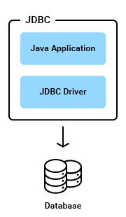

# Java JDBC 

- I part
    - Query processing in the database
    - JDBC driver
- II part
    - Difference between statements
    - Transaction isolation levels

## I part

Ссылка: https://www.progress.com/faqs/datadirect-jdbc-faqs

### Ход запроса в БД

In general, to process any SQL statement with JDBC, you follow these steps:

- Establishing a connection.
- Create a statement.
- Execute the query.
- Process the ResultSet object.
- Close the connection.

```java
class Program {
    public static void viewTable(Connection con) throws SQLException {
        String query = "select COF_NAME, SUP_ID, PRICE, SALES, TOTAL from COFFEES";
        try (Statement stmt = con.createStatement()) {
          ResultSet rs = stmt.executeQuery(query);
          while (rs.next()) {
            String coffeeName = rs.getString("COF_NAME");
            int supplierID = rs.getInt("SUP_ID");
            float price = rs.getFloat("PRICE");
            int sales = rs.getInt("SALES");
            int total = rs.getInt("TOTAL");
            System.out.println(coffeeName + ", " + supplierID + ", " + price +
                               ", " + sales + ", " + total);
          }
        } catch (SQLException e) {
          JDBCTutorialUtilities.printSQLException(e);
        }
      }
}
```

1. First, establish a connection with the data source you want to use. A data source can be a DBMS, a legacy file system, or some other source of data with a corresponding JDBC driver. This connection is represented by a Connection object. See Establishing a Connection for more information.
   
2. A Statement is an interface that represents a SQL statement. You execute Statement objects, and they generate ResultSet objects, which is a table of data representing a database result set. You need a Connection object to create a Statement object. For example, CoffeesTables.viewTable creates a Statement object with the following code: `stmt = con.createStatement();`

3. To execute a query, call an execute method from Statement such as the following:
   
- execute: Returns true if the first object that the query returns is a ResultSet object. Use this method if the query could return one or more ResultSet objects. Retrieve the ResultSet objects returned from the query by repeatedly calling Statement.getResultSet.
- executeQuery: Returns one ResultSet object.
- executeUpdate: Returns an integer representing the number of rows affected by the SQL statement. Use this method if you are using INSERT, DELETE, or UPDATE SQL statements.

For example, CoffeesTables.viewTable executed a Statement object with the following code: `ResultSet rs = stmt.executeQuery(query);`

4. You access the data in a ResultSet object through a cursor. Note that this cursor is not a database cursor. This cursor is a pointer that points to one row of data in the ResultSet object. Initially, the cursor is positioned before the first row. You call various methods defined in the ResultSet object to move the cursor. For example, CoffeesTables.viewTable repeatedly calls the method ResultSet.next to move the cursor forward by one row. Every time it calls next, the method outputs the data in the row where the cursor is currently positioned:

5. When you are finished using a Connection, Statement, or ResultSet object, call its close method to immediately release the resources it's using. Alternatively, use a try-with-resources statement to automatically close Connection, Statement, and ResultSet objects, regardless of whether an SQLException has been thrown. (JDBC throws an SQLException when it encounters an error during an interaction with a data source. See Handling SQL Exceptions for more information.)

JDBC makes it possible to do establish a connection with a data source, send queries and update statements, and process the results.

Simply, JDBC makes it possible to do the following things within a Java application:

- Establish a connection with a data source
- Send queries and update statements to the data source
- Process the results

The following figure shows the components of the JDBC model.



The Java application calls JDBC classes and interfaces to submit SQL statements and retrieve results.

The JDBC API is implemented through the JDBC driver. The JDBC Driver is a set of classes that implement the JDBC interfaces to process JDBC calls and return result sets to a Java application. The database (or data store) stores the data retrieved by the application using the JDBC Driver.

The main objects of the JDBC API include:

- A DataSource object is used to establish connections. Although the Driver Manager can also be used to establish a connection, connecting through a DataSource object is the preferred method.
- A Connection object controls the connection to the database. An application can alter the behavior of a connection by invoking the methods associated with this object. An application uses the connection object to create statements.
- Statement, PreparedStatement, and CallableStatement objects are used for executing SQL statements. A PreparedStatement object is used when an application plans to reuse a statement multiple times. The application prepares the SQL it plans to use. Once prepared, the application can specify values for parameters in the prepared SQL statement. The statement can be executed multiple times with different parameter values specified for each execution. A CallableStatement is used to call stored procedures that return values. The CallableStatement has methods for retrieving the return values of the stored procedure.
- A ResultSet object contains the results of a query. A ResultSet is returned to an application when a SQL query is executed by a statement object. The ResultSet object provides methods for iterating through the results of the query.

### JDBC драйвер

A JDBC driver uses the JDBC™ (Java Database Connectivity) API developed by Sun Microsystems, now part of Oracle, that provides a standard way to access data using the Java™ programming language. Using JDBC, an application can access a variety of databases and run on any platform with a Java Virtual Machine. It isn't necessary to write separate applications to access different database systems (Oracle and Salesforce, for example). Using JDBC allows you to write one application that can send SQL statements to different data sources. SQL is the standard language for accessing relational databases.

The JDBC API defines a set of Java interfaces that encapsulate major database functionality, such as running queries, processing results, and determining configuration information. Because JDBC applications are written in Java, applications work on any platform. Get Started with our JDBC driver now.

### Соединение с базой через JDBC

To connect to a database using JDBC, first we need to load the JDBC driver in to memory and use the DriverManager to get a connection to database. The code to demonstrate this as follows:

```java
public class JDBCUtil {
    String className, URL, user, password;
    Connection connection;

    public JDBCUtil(String className, String URL, String user, String password) {
        this.className = className;
        this.URL = URL;
        this.user = user;
        this.password = password;
        this.connection = null;
    }

    public void getConnection() {
        //Load the driver class
        try {
            Class.forName(className);
        } catch (ClassNotFoundException ex) {
            System.out.println("Unable to load the class. Terminating the program");
            System.exit(-1);
        }
        //get the connection
        try {
            connection = DriverManager.getConnection(URL, user, password);
        } catch (SQLException ex) {
            System.out.println("Error getting connection: " + ex.getMessage());
            System.exit(-1);
        } catch (Exception ex) {
            System.out.println("Error: " + ex.getMessage());
            System.exit(-1);
        }
    }
}
``` 

- The important things to notice here would be the lineClass.forName(className) which is responsible for loading the driver in to the memory. 

- The next important thing is the line connection = DriverManager.getConnection(URL, user, password). This line actually gets the connection to the database if all the parameters are correctly configured and stores it in the connection object which can be used later to execute queries.

- Now let’s talk about the parameters that we pass to the above two steps.

    1. To load the class, we are passing className so that the driver can be loaded in to memory. Each JDBC driver has a unique className, and since we are loading the Progress DataDirect Postgres driver, you can initialize the className property in the JDBCUtil class with driver’s class name of com.ddtek.jdbc.postgresql.PostgreSQLdriver.
    2. The next important value that you would have to pass to get a connection from DriverManager would be the JDBC URL. Every database has a unique way of configuring the URL, and for the Progress DataDirect Postgres JDBC driver it would be in the format of jdbc:datadirect:postgresql://<hostname>:<post>;DatabaseName=<database Name>
    3. The other values that you pass to DriverManager.getConnection() method would be the username and password for your database. If all these values are perfectly configured, you will get back a connection object or you will get an exception.
    4. To connect to Salesforce, you just change the className to com.ddtek.jdbc.sforce.SForceDriver and the JDBC URL for it would be in the format of jdbc:datadirect:sforce://<hostname>;SecurityToken=<token>. With such minimal changes, you can connect to Salesforce easily.
    
**Executing Simple SQL Queries**

```java
class Program {
    public void executeQuery(String query) {
        ResultSet resultSet = null;
        try
        {
            //executing query
            Statement stmt = connection.createStatement();
            resultSet = stmt.executeQuery(query);
            //Get Number of columns
            ResultSetMetaData metaData = resultSet.getMetaData();
            int columnsNumber = metaData.getColumnCount();
            //Printing the results
            while(resultSet.next())
            {
                for(int i = 1; i <= columnsNumber; i++)
                {
                    System.out.printf("%-25s", (resultSet.getObject(i) != null)?resultSet.getObject(i).toString(): null );
                }
            }
        }
        catch (SQLException ex)
        {
            System.out.println("Exception while executing statement. Terminating program... " + ex.getMessage());
        }
        catch (Exception ex)
        {
            System.out.println("General exception while executing query. Terminating the program..." + ex.getMessage());
        }
    }
}
```
 
 The important things to observe are connection.createStatement() and stmt.executeQuery(query). The createStatement() method creates a Statement object for sending SQL statements to your database and executeQuery(query) executes your SQL query and returns a ResultSet object.

## II part

### Отличия между statements

There are three different kinds of statements:

Statement: Used to implement simple SQL statements with no parameters.
PreparedStatement: (Extends Statement.) Used for precompiling SQL statements that might contain input parameters. See Using Prepared Statements for more information.
CallableStatement: (Extends PreparedStatement.) Used to execute stored procedures that may contain both input and output parameters. See Stored Procedures for more information.

### Уровни изоляций транзакций

|Transaction Isolation Level|Description|
|---|---|
|read-uncommitted|Dirty reads, non-repeatable reads, and phantom reads can occur.| 
|read-committed|Dirty reads are prevented; non-repeatable reads and phantom reads can occur.| 
|repeatable-read|Dirty reads and non-repeatable reads are prevented; phantom reads can occur.| 
|serializable|Dirty reads, non-repeatable reads and phantom reads are prevented.| 
