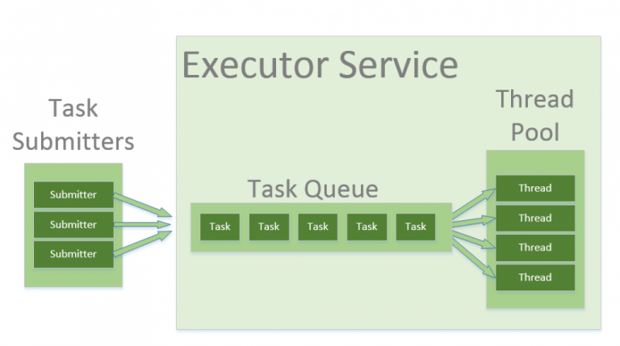

# Java Concurrency

- I part
    - Thread
    - JMM
    - Synchronized
- II part
    - Thread pool
    - Atomic Long, Double, Reference
    - Thread safe collections
    - Volatile
    - Happens Before
    - Deadlock
- III part
    - The specifics of parallel streams
    - Fork Join Pool
    

## I part

### Thread

Ссылка: https://metanit.com/java/tutorial/8.1.php

В Java функциональность отдельного потока заключается в классе Thread. И чтобы создать новый поток, нам надо создать объект этого класса. Но все потоки не создаются сами по себе. Когда запускается программа, начинает работать главный поток этой программы. От этого главного потока порождаются все остальные дочерние потоки.

С помощью статического метода Thread.currentThread() мы можем получить текущий поток выполнения:

```
public static void main(String[] args) {         
    Thread t = Thread.currentThread(); // получаем главный поток
    System.out.println(t.getName()); // main
}
```

По умолчанию именем главного потока будет main.

Для управления потоком класс Thread предоставляет еще ряд методов. Наиболее используемые из них:

- getName(): возвращает имя потока
- setName(String name): устанавливает имя потока
- getPriority(): возвращает приоритет потока
- setPriority(int proirity): устанавливает приоритет потока. Приоритет является одним из ключевых факторов для выбора системой потока из кучи потоков для выполнения. В этот метод в качестве параметра передается числовое значение приоритета - от 1 до 10. По умолчанию главному потоку выставляется средний приоритет - 5.
- isAlive(): возвращает true, если поток активен
- isInterrupted(): возвращает true, если поток был прерван
- join(): ожидает завершение потока
- run(): определяет точку входа в поток
- sleep(): приостанавливает поток на заданное количество миллисекунд
- start(): запускает поток, вызывая его метод run()


### JMM

Ссылка [Ноги у JMM]: https://habr.com/ru/post/440590/
Ссылка [JMM]: https://habr.com/ru/company/golovachcourses/blog/221133/

В многопроцессорных системах, процессоры обычно имеют один или более слоев кэш-памяти, что повышает производительность как за счет ускорения доступа к данным (поскольку данные ближе к процессору) так и за счет сокращения трафика на шине разделяемой памяти (поскольку многие операции с памятью могут быть удовлетворены локальными кэшами.) Кэши могут чрезвычайно  повысить производительность, но их использование бросает и множество новых вызовов. Что, например, происходит, когда два процессора рассматривают одну и ту же ячейку памяти в одно и то же время? При каких условиях они будут видеть одинаковые значения?

На уровне процессора, модель памяти определяет необходимые и достаточные условия для гарантии того, что записи в память другими процессорами будут видны текущему процессору, и записи текущего процессора будут видимы другими процессорами. Некоторые процессоры демонстрируют сильную модель памяти, где все процессоры всегда видят точно одинаковые значения для любой заданной ячейки памяти. Другие процессоры демонстрируют более слабую модель памяти, где специальные инструкции, называемые барьерами памяти, требуются для «сброса» (flush) или объявления недействительными (invalidate) данных в локальном кэше процессора, с целью сделать записи данного процессора видимыми для других или увидеть записи, сделанные другими процессорами. Эти барьеры памяти, как правило, выполняются при захвате (lock) и освобождении (unlock) блокировки; они невидимы для программистов на языках высокого уровня.

Иногда бывает проще писать программы для сильных моделей памяти, из-за снижения потребности в барьерах. Тем не менее, даже на сильнейших моделях памяти, барьеры зачастую необходимы; довольно часто их размещение является противоречащим интуиции. Последние тенденции в области дизайна процессоров поощряют более слабые модели памяти, поскольку послабления, которые они делают для согласованности кэшей обеспечивают повышенную масштабируемость на нескольких процессорах и больших объемах памяти.

Вопрос о том, когда запись становится видимой другому потоку усугубляется переупорядочением инструкций компилятором. Например, компилятор может решить, что более эффективно переместить операцию записи дальше в программе; до тех пор, покуда перемещение кода не меняет семантику программы, он может свободно это делать. Если компилятор задерживает операцию, другой поток не увидит пока она не осуществится; это демонстрирует эффект кэширования.

Кроме того, запись в памяти может быть перемещена раньше в программе; в этом случае, другие потоки могут увидеть запись, прежде чем он на самом деле «происходит». Вся эта гибкость является особенностью дизайна — давая компилятору, среде исполнения и аппаратному обеспечению гибкость выполнять операции в оптимальном порядке в рамках модели памяти, мы можем достичь более высокой производительности.

Простой пример этого можно увидеть в следующем фрагменте кода:

```java
class Reordering {
    int x = 0, y = 0;
    public void writer() {
        x = 1;
        y = 2;
    }
    public void reader() {
        int r1 = y;
        int r2 = x;
    }
}
```

Давайте предположим, что этот код выполняется в двух потоках одновременно и чтение 'у' возвращает значение 2. Поскольку эта запись расположена после записи в 'х', программист может предположить, что чтение 'х' должно вернуть значение 1. Тем не менее, запись в 'x' и 'y', возможно, были переупорядочены. Если это имело место, то могла произойти запись в 'у', затем чтение обеих переменных, и только потом запись в 'х'.Результатом будет то, что r1 имеет значение 2, а r2 имеет значение 0.

Модель памяти Java описывает то, какое поведение является законным в многопоточном коде и, как потоки могут взаимодействовать через память. Она описывает отношения между переменными в программе и низкоуровневые детали сохранения и извлечения их в и из памяти или регистров в реальной компьютерной системе. Модель определяет это таким образом, что это может быть реализовано корректно используя широкий спектр аппаратного оборудования и большое разнообразие оптимизаций компилятора.

Java включает в себя несколько языковых конструкций, в том числе volatile, final и synchronized, которые предназначены, для того, чтобы помочь программисту описать компилятору требования к параллелизму в программе. Модель памяти Java определяет поведение volatile и synchronized, и, что более важно, гарантирует, что корректно синхронизированная Java-программа работает правильно на всех процессорных архитектурах.

### Synchronized

Ссылка: https://javarush.ru/groups/posts/1994-sinkhronizacija-potokov-operator-synchronized

`synchronized` помечается определенный кусок нашего кода. Если блок кода помечен ключевым словом synchronized, это значит, что блок может выполняться только одним потоком одновременно.

Синхронизацию можно реализовать по-разному. Например, создать целый синхронизированный метод:

```
public synchronized void doSomething() {
   //...логика метода
}
```

Или же написать блок кода, где синхронизация осуществляется по какому-то объекту:

```java
public class Main {
   private Object obj = new Object();

   public void doSomething() {
       //...какая-то логика, доступная для всех потоков
       synchronized (obj) {
           //логика, которая одновременно доступна только для одного потока
       }
   }
}
```

Если один поток зашел внутрь блока кода, который помечен словом synchronized, он моментально захватывает мьютекс объекта, и все другие потоки, которые попытаются зайти в этот же блок или метод вынуждены ждать, пока предыдущий поток не завершит свою работу и не освободит монитор.

## II part

### Thread pool

Ссылка [пул потоков в java]: https://habr.com/ru/post/326146/
Ссылка [thread pool in java]: https://www.baeldung.com/thread-pool-java-and-guava

In Java, threads are mapped to system-level threads which are operating system's resources. If you create threads uncontrollably, you may run out of these resources quickly.

The context switching between threads is done by the operating system as well – in order to emulate parallelism. A simplistic view is that – the more threads you spawn, the less time each thread spends doing actual work.

The Thread Pool pattern helps to save resources in a multithreaded application, and also to contain the parallelism in certain predefined limits.

When you use a thread pool, you write your concurrent code in the form of parallel tasks and submit them for execution to an instance of a thread pool. This instance controls several re-used threads for executing these tasks.



The pattern allows you to control the number of threads the application is creating, their lifecycle, as well as to schedule tasks' execution and keep incoming tasks in a queue.

### Atomic Long, Double, Reference

Ссылка: https://tproger.ru/translations/java8-concurrency-tutorial-3/

**AtomicInteger**

Пакет java.concurrent.atomic содержит много полезных классов для выполнения атомарных операций. Операция называется атомарной тогда, когда её можно безопасно выполнять при параллельных вычислениях в нескольких потоках, не используя при этом ни блокировок, ни synchronized, как мы это делали в предыдущем уроке.

Внутри атомарные классы очень активно используют сравнение с обменом (compare-and-swap, CAS), атомарную инструкцию, которую поддерживает большинство современных процессоров. Эти инструкции работают гораздо быстрее, чем синхронизация с помощью блокировок. Поэтому, если вам просто нужно изменять одну переменную с помощью нескольких потоков, лучше выбирать атомарные классы.

Приведу несколько примеров с использованием AtomicInteger, одного из атомарных классов:

```
AtomicInteger atomicInt = new AtomicInteger(0);

ExecutorService executor = Executors.newFixedThreadPool(2);

IntStream.range(0, 1000)
    .forEach(i -> executor.submit(atomicInt::incrementAndGet));

stop(executor);

System.out.println(atomicInt.get());    // => 1000
```

Как видите, использование AtomicInteger вместо обычного Integer позволило нам корректно увеличить число, распределив работу сразу по двум потокам. Мы можем не беспокоиться о безопасности, потому что incrementAndGet() является атомарной операцией.

Класс AtomicInteger поддерживает много разных атомарных операций. Метод updateAndGet() принимает в качестве аргумента лямбда-выражение и выполняет над числом заданные арифметические операции:

```
AtomicInteger atomicInt = new AtomicInteger(0);

ExecutorService executor = Executors.newFixedThreadPool(2);

IntStream.range(0, 1000)
    .forEach(i -> {
        Runnable task = () ->
            atomicInt.updateAndGet(n -> n + 2);
        executor.submit(task);
    });

stop(executor);

System.out.println(atomicInt.get());    // => 2000
```

Метод accumulateAndGet() принимает лямбда-выражения типа IntBinaryOperator. Вот как мы можем использовать его, чтобы просуммировать все числа от нуля до тысячи:

```
AtomicInteger atomicInt = new AtomicInteger(0);

ExecutorService executor = Executors.newFixedThreadPool(2);

IntStream.range(0, 1000)
    .forEach(i -> {
        Runnable task = () ->
            atomicInt.accumulateAndGet(i, (n, m) -> n + m);
        executor.submit(task);
    });

stop(executor);

System.out.println(atomicInt.get());    // => 499500
```

Среди других атомарных классов хочется упомянуть такие как AtomicBoolean, AtomicLong и AtomicReference.

### Потокобезопасные коллекции

Пакет java.util.concurrent включает несколько потокобезопасных коллекций :

- ConcurrentHashMap	коллекция типа HashMap, реализующая интерфейс ConcurrentMap;
- CopyOnWriteArrayList	коллекция типа ArrayList с алгоритмом CopyOnWrite;
- CopyOnWriteArraySet	реализация интерфейса Set, использующая за основу CopyOnWriteArrayList;
- ConcurrentNavigableMap	расширяет интерфейс NavigableMap;
- ConcurrentSkipListMap	аналог коллекции TreeMap с сортировкой данных по ключу и с поддержкой многопоточности;
- ConcurrentSkipListSet	реализация интерфейса Set, выполненная на основе класса ConcurrentSkipListMap.

### Volatile

volatile - ключевое слово, которое не позволяет JVM помещать переменную в кэш

При создании многопоточных приложений мы можем столкнуться с двумя серьезными проблемами.

Во-первых, в процессе работы многопоточного приложения разные потоки могут кэшировать значения переменных (мы уже говорили об этом в лекции «Применение volatile»).

Возможна ситуация, когда один поток изменил значение переменной, а второй не увидел этого изменения, потому что работал со своей, кэшированной копией переменной.

Естественно, последствия могут быть серьезными. Представь, что это не просто какая-то «переменная», а, например, баланс твоей банковской карты, который вдруг начал рандомно скакать туда-сюда :) Не очень приятно, да?

Во-вторых, в Java операции чтения и записи полей всех типов, кроме long и double, являются атомарными. 

Что такое атомарность? 

Ну, например, если ты в одном потоке меняешь значение переменной int, а в другом потоке читаешь значение этой переменной, ты получишь либо ее старое значение, либо новое — то, которое получилось после изменения в потоке 1. Никаких «промежуточных вариантов» там появиться не может.

Однако с long и double это не работает. Почему?

Из-за кроссплатформенности.

Помнишь, мы еще на первых уровнях говорили, что принцип Java — «написано однажды — работает везде»? Это и есть кроссплатформенность. То есть Java-приложение запускается на абсолютно разных платформах. Например, на операционных системах Windows, разных вариантах Linux или MacOS, и везде это приложение будет стабильно работать. 

Long и double — самые «тяжеловесные» примитивы в Java: они весят по 64 бита. И в некоторых 32-битных платформах просто не реализована атомарность чтения и записи 64-битных переменных. Такие переменные читаются и записываются в две операции. Сначала в переменную записываются первые 32 бита, потом еще 32.

Соответственно, в этих случаях может возникнуть проблема. Один поток записывает какое-то 64-битное значение в переменную Х, и делает он это «в два захода». В то же время второй поток пытается прочитать значение этой переменной, причем делает это как раз посередине, когда первые 32 бита уже записаны, а вторые — еще нет. В результате он читает промежуточное, некорректное значение, и получается ошибка. 

Например, если на такой платформе мы попытаемся записать в переменную число —

9223372036854775809

— оно будет занимать 64 бита. В двоичной форме оно будет выглядеть так:

1000000000000000000000000000000000000000000000000000000000000001

Первый поток начнет запись этого числа в переменную, и сначала запишет первые 32 бита:

10000000000000000000000000000000

а потом вторые 32:

0000000000000000000000000000001

И в этот промежуток может вклиниться второй поток, и прочитать промежуточное значение переменной — 10000000000000000000000000000000, первые 32 бита, которые уже были записаны.

В десятичной системе это число равняется 2147483648. 

То есть мы всего лишь хотели записать число 9223372036854775809 в переменную, но из-за того, что эта операция на некоторых платформах является не атомарной, у нас из ниоткуда возникло «левое», ненужное нам число 2147483648, и неизвестно как оно повлияет на работу программы. Второй поток просто прочитал значение переменной до того, как оно окончательно записалось, то есть первые 32 бита он увидел, а вторые 32 бита — нет.

Эти проблемы, конечно, возникли не вчера, и в Java они решаются с помощью всего одного ключевого слова — volatile.

Если мы объявляем в нашей программе какую-то переменную, со словом volatile

```java
public class Main {
   public volatile long x = 2222222222222222222L;

   public static void main(String[] args) {

   }
}
```

1. Она всегда будет атомарно читаться и записываться. Даже если это 64-битные double или long.
2. Java-машина не будет помещать ее в кэш. Так что ситуация, когда 10 потоков работают со своими локальными копиями исключена.

### Как обеспечивается HB участков кода в java приложении

### Happens Before

Пусть есть поток X и поток Y (не обязательно отличающийся от потока X). И пусть есть операции A (выполняющаяся в потоке X) и B (выполняющаяся в потоке Y).

В таком случае, A happens-before B означает, что все изменения, выполненные потоком X до момента операции A и изменения, которые повлекла эта операция, видны потоку Y в момент выполнения операции B и после выполнения этой операции.

Happens Before — отношение строгого частичного порядка (антирефлексивное, антисимметричное, транзитивное), введённое между атомарными командами (++ и -- не атомарны), придуманное Лесли Лэмпортом и не означающее «физически прежде». Оно значит, что вторая команда будет «в курсе» изменений, проведённых первой.

В частности, одно выполняется прежде другого для таких операций (список не исчерпывающий):

- Синхронизация и мониторы:
    - Захват монитора (начало synchronized, метод lock) и всё, что после него в том же потоке.
    - Возврат монитора (конец synchronized, метод unlock) и всё, что перед ним в том же потоке.
        - Таким образом, оптимизатор может заносить строки в синхроблок, но не наружу.
    - Возврат монитора и последующий захват другим потоком.
- Запись и чтение:
    - Любые зависимости по данным (то есть запись в любую переменную и последующее чтение её же) в одном потоке.
    - Всё, что в том же потоке перед записью в volatile-переменную, и сама запись.
    - volatile-чтение и всё, что после него в том же потоке.
    - Запись в volatile-переменную и последующее считывание её же. Таким образом, volatile-запись делает с памятью то же, что возврат монитора, а чтение — то же, что захват. А значит: если один поток записал в volatile-переменную, а второй обнаружил это, всё, что предшествует записи, выполняется раньше всего, что идёт после чтения; см. иллюстрацию.
        - Для объектных переменных (например, volatile List x;) столь сильные гарантии выполняются для ссылки на объект, но не для его содержимого.
- Обслуживание объекта:
    - Статическая инициализация и любые действия с любыми экземплярами объектов.
    - Запись в final-поля в конструкторе и всё, что после конструктора. Как исключение из всеобщей транзитивности, это соотношение happens-before не соединяется транзитивно с другими правилами и поэтому может вызвать межпоточную гонку.
    - Любая работа с объектом и finalize().
- Обслуживание потока:
    - Запуск потока и любой код в потоке.
    - Зануление переменных, относящихся к потоку, и любой код в потоке.
    - Код в потоке и join(); код в потоке и isAlive() == false.
    - interrupt() потока и обнаружение факта останова.

### Deadlock

Deadlock или дедлок или взаимная блокировка — это ошибка, которая происходит когда нити имеют циклическую зависимость от пары синхронизированных объектов. Представьте, что одна нить входит в монитор объекта x, а другая — объекта y. Если нить в объекте x пытается вызвать любой синхронизированный метод объекта y, а объект y в то же самое время пытается вызвать любой синхронизированный метод объекта x, то нити застрянут в процессе ожидания. 
  
```java
public class Deadlock {
    static class Friend {
        private final String name;
        public Friend(String name) {
            this.name = name;
        }
        public String getName() {
            return this.name;
        }
        public synchronized void bow(Friend bower) {
            System.out.format("%s: %s" + "  has bowed to me!%n", this.name, bower.getName());
            bower.bowBack(this);
        }
        public synchronized void bowBack(Friend bower) {
            System.out.format("%s: %s"
                + " has bowed back to me!%n",
                this.name, bower.getName());
        }
    }

    public static void main(String[] args) {
        final Friend alphonse =
            new Friend("Alphonse");
        final Friend gaston =
            new Friend("Gaston");
        new Thread(new Runnable() {
            @Override
            public void run() {
               // System.out.println("Thread 1");
                alphonse.bow(gaston);
               // System.out.println("Th: gaston bowed to alphonse");
            }
        }).start();

        new Thread(new Runnable() {
            @Override
            public void run() {
              //  System.out.println("Thread 2");
                gaston.bow(alphonse);
              //  System.out.println("2.gaston waiting alph bowed");
            }
        }).start();
    }
}
```

Здесь нужно понять две важные вещи:
Что именно делает каждая из одновременно выполняющихся нитей?
Какие локи используются?
Начнем с конца. Допустим, вы создали два объекта класса Friend: alphonse и gaston. У каждого из них есть свой лок. Таким образом, этих локов два: альфонсов и гастонов. При входе в синхронизированный метод объекта, его лок запирается, а когда из метода выходят, он  освобождается (или отпирается).

Теперь о нитях. Назовем первую нить Alphonse (с большой буквы, чтобы отличить от объекта alphonse). Вот что она делает (обозначим её буквой A, сокращённо от Alphonse): 

```
A: alphonse.bow(gaston) — получает лок alphonse;
A: gaston.bowBack(alphonse) — получает лок gaston;
A: возвращается из обоих методов, тем самым освобождая лок.
```

А вот чем в это время занята нить Gaston: 

```
G: gaston.bow(alphonse) — получает лок gaston;
G: alphonse.bowBack(gaston) — получает лок alphonse;
G: возвращается из обоих методов, тем самым освобождая лок.
```

Теперь сведем эти данные вместе и получим ответ. Нити могут переплетаться (то есть, их события совершатся) в разных порядках. Дедлок получится, например, если порядок будет таким:

```
A: alphonse.bow(gaston) — получает лок alphonse
G: gaston.bow(alphonse) — получает лок gaston
G: пытается вызвать alphonse.bowBack(gaston), но блокируется, ожидая лока alphonse
A: пытается вызвать gaston.bowBack(alphonse), но блокируется, ожидая лока gaston
```

В этом случае обе нити заблокированы и каждая ожидает, что другая отдаст лок. Но ни одна это не сделает, потому что для этого нужно завершить свой метод, а он заблокирован другой нитью. Поэтому они застряли на месте, случился deadlock.

Впрочем, возможно и другое переплетение, в котором одна из нитей успеет завершиться до начала второй:

```
A: alphonse.bow(gaston) — получает лок alphonse
A: gaston.bowBack(alphonse) — получает лок gaston
A: возвращается из обоих методов, открывая оба лока
G: gaston.bow(alphonse) — получает лок gaston
G: alphonse.bowBack(gaston) — получает лок alphonse
G: возвращается из обоих методов, открывая оба лока
```

В этом случае взаимной блокировки нитей нет. Например, добавлен какой-то метод, позволяющий другой нити успеть выполниться.

Когда результат зависит от порядка одновременно происходящих событий (запланированного порядка или скорости выполнения), такой процесс называется race condition по-русски — «состояние гонки». Не все race condition потенциально производят дедлок, однако, по моему опыту, дедлоки происходят только в race condition.


## III part

### Специфика работы параллельных стримов

### Fork Join Pool
