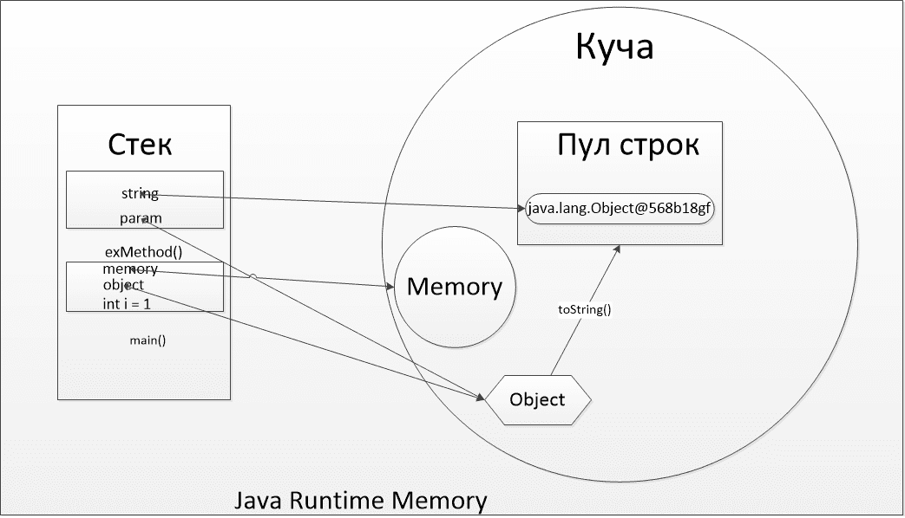

# Java JVM 

- I part
    - Garbage Collector (General Principle of Operation)
    - Heap, Stack
    - How does JVM work? (What happens to the code we write)
    - JVM, JDK
- II part
    - JIT compiler
    - JVM и GC flags
    - Classloaders
    - Main garbage collectors
- III part
    - Frames
    

## I part

### Сборщик мусора (Общий принцип работы)

**Запуск сборщика мусора**

JVM обычно запускает сборщик мусора при низком уровне свободной памяти. Но работа сборщика мусора не гарантирует, что всегда будет оставаться достаточно свободной памяти.

Если памяти недостаточно даже после восстановления, JVM генерирует исключение OutOfMemoryError. Обратите внимание, что перед генерированием исключения JVM обязательно запускает сборщик мусора как минимум 1 раз.

Вы можете запросить запуск сборщика мусора, но вы не можете принудительно задавать это действие.

**Запрос запуска сборщика мусора**

Для запроса вы можете вызвать один из следующих методов:
```
System.gc()
Runtime.getRuntime().gc()
```

**Пригодность для запуска сборщика мусора**

Объект подлежит утилизации, когда он недоступен живому потоку.

Объект может подлежать утилизации в разных случаях:

- Если переменная ссылочного типа, которая ссылается на объект, установлена в положение "0", объект подлежит утилизации, в том случае, если на него нет других ссылок.
- Если переменная ссылочного типа, которая ссылается на объект, создана для ссылки на другой объект, объект подлежит утилизации, в том случае, если на него нет других ссылок.
- Объекты, созданные локально в методе, подлежат утилизации, когда метод завершает работу, если только они не экспортируются из этого метода (т.е, возвращаются или генерируются как исключение).
- Объекты, которые ссылаются друг на друга, могут подлежать утилизации, если ни один из них не доступен живому потоку.

```java
public class TestGC
  {
    public static void main(String [] args)
    {
      Object o1 = new Integer(3);               // Line 1
      Object o2 = new String("Tutorial");       // Line 2
      o1 = o2;                                  // Line 3
      o2 = null;                                // Line 4
      // Rest of the code here
    }
  }
```


В этом примере объект Integer (целочисленный), на который первоначально ссылается указатель o1 может подвергаться утилизации после строки 3, так как o1 теперь ссылается на объект String (строковый). Несмотря на то, что o2 создан для ссылки к нулю, объект String (строковый) не подлежит утилизации, так как o1 ссылается на него.

**Финализация**

Java-технология позволяет использовать метод finalize() (финализировать), чтобы произвести необходимую очистку перед тем, как сборщик мусора извлекает объект из памяти. Этот метод вызывается для объекта сборщиком мусора, когда сборщик мусора вычисляет, что ссылок к объекту больше нет. Это описано в классе Object, а значит, это наследуется всеми классами. Подкласс отменяет метод finalize(), чтобы освободиться от системных ресурсов или для ещё одной очистки:

`protected void finalize() throws Throwable`

Если незарегистрированное исключение генерируется методом finalize(), то исключение игнорируется и финализация этого объекта прекращается.

Метод finalize() будет активизирован только один раз за время существования объекта.

Возможно использование метода finalize() любого объекта, чтобы защитить его от утилизации. Но в этом случае сборщик мусора уже не активирует finalize() для этого объекта.

Метод finalize() всегда будет активизирован один раз перед тем, как объект будет удалён сборщиком мусора. Однако, возможно, что метод finalize() не будет активизирован для данного объекта за всё время его существования, так как он может не подлежать утилизации.

### Хип, стек

**Java Heap**

Java Heap (куча) используется Java Runtime для выделения памяти под объекты и JRE классы. Создание нового объекта также происходит в куче. Здесь работает сборщик мусора: освобождает память путем удаления объектов, на которые нет каких-либо ссылок. Любой объект, созданный в куче, имеет глобальный доступ и на него могут ссылаться с любой части приложения.

**Java Stack**

Стековая память в Java работает по схеме LIFO (Последний-зашел-Первый-вышел). Всякий раз, когда вызывается метод, в памяти стека создается новый блок, который содержит примитивы и ссылки на другие объекты в методе. Как только метод заканчивает работу, блок также перестает использоваться, тем самым предоставляя доступ для следующего метода.
Размер стековой памяти намного меньше объема памяти в куче.

```java
public class Memory {
    public static void main(String[] args) { // строка 1
        int i=1; // строка 2
        Object object = new Object(); // строка 3
        Memory memory = new Memory(); // строка 4
        memory.exMethod(object); // строка 5
    } // строка 9
 
    private void exMethod(Object param) { // строка 6
        String string = param.toString(); // строка 7
        System.out.println(string );
    } // строка 8
 
}
```



А теперь рассмотри шаги выполнения нашей программы:

1. Как только мы запустим программу, загружаются все классы среды выполнения в кучу. Потом  метод main()находит строку 1 и Java Runtime создает стековую память для использования методом main().
2. Далее в строке 2 создается int’овая переменная, которая хранится в памяти стека метода main().
3. Потом мы создали объект в строке 3 и он тут же появляется в куче, а стековая память содержит ссылку на него. Точно такой же процесс происходит, когда мы создаем объект Memory в строке 4.
4. Теперь в строке 5 мы вызываем метод exMethod() и тут же сразу создается блок на вершине стека, который будет использоваться этим методом. Поскольку в Java объекты и примитивы передаются по значению, то в строке 6 будет создана новая ссылка на объект, созданный в строке 3.
5. Строка, созданная в строке 7, отправляется в Пул строк (String Pool), который находится в куче. На эту строку также создается ссылка в стековой памяти метода exMethod().
6. Метод exMethod()завершается на строке 8, поэтому блок стековой памяти для этого метода становится свободным.
7. В строке 9 метод main() завершается, поэтому стековая память для метода main() будет уничтожена. Также программа заканчивается в этой строке, следовательно, Java Runtime освобождает всю память и завершает программу.

**Разница между Stack и Heap памятью в Java**

На основании приведенных выше объяснений, мы можем легко подытожить следующие различия между Heap и Stack памятью в Java.

- Куча используется всеми частями приложения в то время как стек используется только одним потоком исполнения программы.
- Всякий раз, когда создается объект, он всегда хранится в куче, а в памяти стека содержится ссылка на него. Память стека содержит только локальные переменные примитивных типов и ссылки на объекты в куче.
- Объекты в куче доступны с любой точки программы, в то время как стековая память не может быть доступна для других потоков.
- Управление памятью в стеке осуществляется по схеме LIFO.
- Стековая память существует лишь какое-то время работы программы, а память в куче живет с самого начала до конца работы программы.
- Мы можем использовать -Xms и -Xmx опции JVM, чтобы определить начальный и максимальный размер памяти в куче. Для стека определить размер памяти можно с помощью опции -Xss .
- Если память стека полностью занята, то Java Runtime бросает java.lang.StackOverflowError, а если память кучи заполнена, то бросается исключение java.lang.OutOfMemoryError: Java Heap Space.
- Размер памяти стека намного меньше памяти в куче. Из-за простоты распределения памяти (LIFO), стековая память работает намного быстрее кучи.

### Как работает JVM? (Те что происходит с кодом который мы пишем)

### JVM, JDK

## II part

### JIT комлиллятор (что такое)

### Jvm и GC флаги

### Класслоадеры

### Основные сборшики мусора

